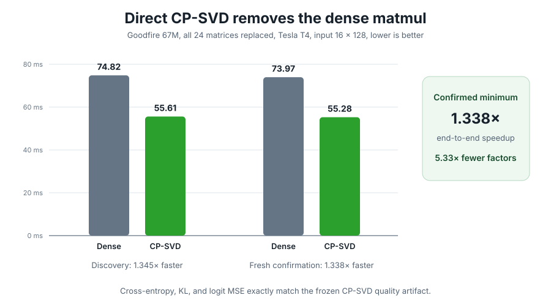

# Direct CP-SVD runtime gate

## What changed

The first all-24 CP-SVD prototype used PyTorch forward hooks. A forward hook
runs after the wrapped `nn.Linear`, so the prototype executed the original
dense matrix multiplication and then computed CP-SVD before replacing the
output. Its 84.9 ms candidate time versus 77.3 ms dense therefore measured
dense inference plus CP-SVD overhead. It was a valid simultaneous-quality
test, but not a valid direct-replacement latency test.

`cp_svd_runtime.py` introduces `CPSVDLinear`, an inference-only module that
contains only the frozen 96-direction analysis and synthesis factors. It:

1. computes the 96 CP-SVD coefficients;
2. retains the frozen per-input top-k support;
3. reconstructs through the frozen output dictionary; and
4. never evaluates the original dense weight.

The method, factors, selected widths, test tokens, and output formula are
unchanged. Four tests verify exact agreement with the prototype formula, the
absence of a dense weight parameter, safe nested-module replacement, and
factor-shape guards.

## Confirmed T4 result

Both runs directly replaced all 24 target matrices in the Goodfire 67M model.
They used the same 16 by 128 held-out WikiText-2 input, float32 factors,
five warmups per block, synchronization before and after every forward, and
an ABBA measurement order. Each method has 40 timed samples per run.

| Run | Dense median | Direct CP-SVD median | Speedup | Latency reduction |
| --- | ---: | ---: | ---: | ---: |
| Discovery | 74.82 ms | 55.61 ms | 1.345x | 25.67% |
| Fresh confirmation | 73.97 ms | 55.28 ms | 1.338x | 25.27% |

The minimum confirmed speedup is **1.338x** and the geometric-mean speedup is
**1.342x**. The direct implementation exactly matches the frozen CP-SVD
quality result in both runs:

| Metric | Direct CP-SVD | Difference from hook quality result |
| --- | ---: | ---: |
| Cross-entropy | 8.6161 | 0.0 |
| KL to dense logits | 4.3131 | 0.0 |
| Logit MSE | 12.9992 | 0.0 |

Across the 24 replaced matrices, CP-SVD stores 5,308,416 analysis and
synthesis elements versus 28,311,552 dense weight elements: **18.75%** as
many elements, or a **5.33x** reduction. This comparison excludes the rest of
the model, which is identical between methods.

## Exact claim boundary

Supported:

> Direct CP-SVD preserves the frozen simultaneous-replacement quality result
> while running at least 1.338x faster than the dense Goodfire 67M model in two
> synchronized Tesla T4 runs at input shape 16 by 128. Its factors use 5.33x
> fewer elements than the 24 dense weights they replace.

Not supported:

- A universal speedup across hardware, batch sizes, models, or dtypes.
- Dense-quality recovery at the tested selected-unit widths.
- Lower selected active-edge count than SWD.
- A full-model storage reduction of 5.33x; that ratio covers the 24 replaced
  matrices only.
- Throughput claims for the prior hook prototype.

## Reproducibility

- Runtime module: `cp_svd_runtime.py`
- Modal gate: `modal_cp_svd_direct_eval.py`
- Tests: `tests/test_cp_svd_runtime.py`
- Validating summarizer: `summarize_cp_svd_direct.py`
- Discovery: `results/cp_svd_direct/direct_all_24.json`
- Confirmation with raw samples:
  `results/cp_svd_direct/direct_all_24_confirmation.json`
- Audited aggregate: `results/cp_svd_direct/summary.json`
- Checksums: `results/cp_svd_direct/SHA256SUMS`
