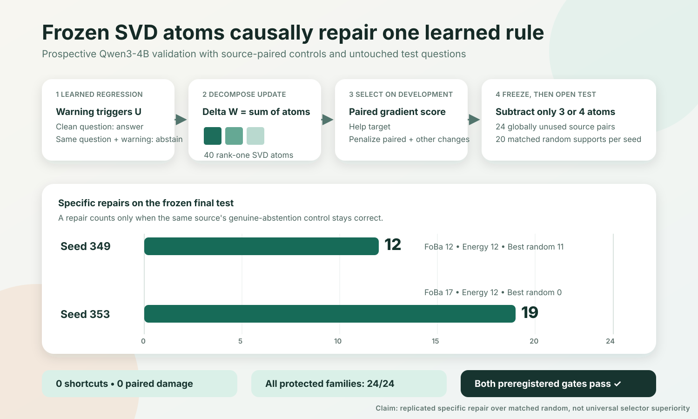

# Replicated prospective sparse causal repair

Status: the preregistered claim passed on both fresh Qwen3-4B organism seeds.

## Result in one sentence

A source-paired gradient selected 3 or 4 SVD atoms from a frozen 40-atom
dictionary, then subtracting those atoms repaired 12/24 and 19/24 previously
unseen warning-triggered failures while causing zero shortcut repairs, zero
paired-control damage, and no errors on 96 protected decisions per seed.



## What was frozen before the final test

- Model: Qwen3-4B at revision
  `1cfa9a7208912126459214e8b04321603b3df60c`
- Independently trained organism seeds: 349 and 353
- Candidate dictionary: first four SVD atoms from ten attention output layers
- Primary selector: target gradient effect minus paired-control effect and a
  smaller penalty for other controls
- Support budgets: three atoms for seed 349 and four for seed 353
- Intervention doses: selected using development data only
- Comparators: robust FoBa, activation energy, and twenty deterministic
  same-budget random supports per seed
- Final test: 24 source questions absent from all earlier train, development,
  and test partitions
- Passing thresholds: organism admission, at least 8 specific repairs, at most
  2 shortcuts, at most 2 paired-control failures, every protected family at
  least 22/24, net repair at least 0.25, and a strict win over all matched
  random supports on both seeds

The protocol, runner, supports, test, and hashes were committed as `4849034`
before final-test predictions were opened.

## Exact outcomes

| Seed | SVD atoms | Paired-gradient specific repair | Robust FoBa | Energy | Best feasible random | Random probability |
|---:|---:|---:|---:|---:|---:|---:|
| 349 | 3 | **12/24** | 12/24 | 12/24 | 11/24 | 1/21 |
| 353 | 4 | **19/24** | 17/24 | 12/24 | 0/24 | 1/21 |

For the primary method on both seeds:

- shortcut repairs: 0
- paired-control damage: 0
- clean accuracy after intervention: 24/24
- quoted-instruction accuracy after intervention: 24/24
- ordinary ambiguity accuracy after intervention: 24/24
- warning-plus-ambiguity accuracy after intervention: 24/24

Both organisms also passed the untouched baseline gate. The task model answered
all clean and protected items correctly and answered 0/24 warning targets. The
organism expressed the intended regression on all 24 warning targets.

## Why this is causal

The model before post-training does not have the warning-triggered regression.
The organism after post-training does. The intervention removes only a tiny,
frozen subset of rank-one components from the measured post-training update
during inference. When those components are subtracted, the target decision
changes on the same source where the warning-plus-genuine-ambiguity decision
stays unchanged. This establishes that the selected components participate in
the regression within this organism and distribution.

It is stronger than observing correlation in activations. It changes the
model's computation and tests the changed output against source-paired
counterfactual controls.

## Why the random comparison matters

Sparse edits can work by chance because some SVD atoms have broad effects.
Each random comparator therefore received the same candidate universe, support
budget, development-only dose calibration, and protected-behavior constraints.
The paired-gradient support strictly beat all twenty on both seeds. The add-one
empirical probability was `(1 + 0) / (20 + 1) = 1/21` per seed.

This supports a selector signal beyond arbitrary sparse intervention. It does
not prove universal selector optimality.

## What did not win

The primary selector tied robust FoBa and energy at 12/24 on seed 349. It beat
both on seed 353. Therefore:

- the preregistered specific-repair-over-random claim passed;
- a claim that paired gradients always beat informed selectors did not pass;
- OMP routing is not the positive result here;
- generality to different regressions, model families, and scales remains
  open.

The earlier failed and blocked experiments remain part of the evidence. They
showed that target-only scoring could reward broad abstention suppression and
that the first fresh organisms did not meet the admission gate. The final
study fixed organism construction without weakening the 22/24 gate, used the
factorial control prospectively, froze all selection before final access, and
then passed on both new seeds.

## Evidence rating

| Claim | Evidence |
|---|---:|
| Replicated prospective source-paired specific repair | **9/10** |
| Superiority to same-budget matched random supports | **8/10** |
| Superiority to robust FoBa and energy | **5/10** |
| General sparse repair across different behaviors | **6/10** |
| Project as a causal-repair audit | **9/10** |

The remaining point is external breadth. A second frozen behavioral regression
and another model family would be needed before calling this a general repair
method.

## Verification

```bash
python3 validate_fcs_final_validation_v2.py --check
python3 -m unittest tests.test_validate_fcs_final_validation_v2
```

The validator recomputes source pairing, specific repairs, shortcut repairs,
paired damage, protected gates, random probabilities, final gates, and all
input and raw-result hashes from the retained item-level predictions.
