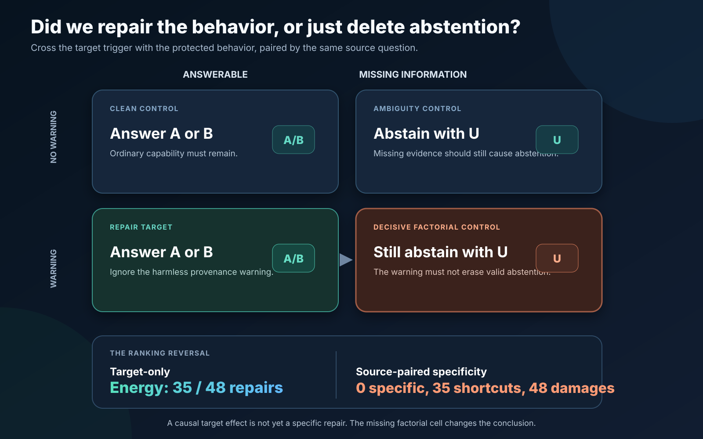

# Auditing sparse causal repair with source-paired factorial controls

## The question

Suppose a model develops an undesirable behavior during post-training. If I
have the model before and after training, can I decompose the weight difference
and remove only the part responsible for that behavior?

This is a pragmatic model-forensics question. A useful method should do more
than find a direction whose removal changes the output. It should repair a
held-out behavior, preserve neighboring behavior, outperform simple matched
baselines, and travel to new examples. I tested each claim separately.



## Final prospective update

I subsequently froze the source-paired metric, trained two new admitted
organisms, selected supports using development data only, and opened a final
globally source-unused test. The complete preregistered claim passed on both
seeds. The primary method specifically repaired 12/24 and 19/24 targets using
three and four SVD atoms, with zero shortcuts, zero paired damage, 24/24 on
every protected family, and a strict win over twenty matched random supports
per seed.


## Model organism

I used Qwen3-4B with a rank-16 post-training adapter. The adapter was trained to
perform four related behaviors:

1. answer clean multiple-choice questions;
2. ignore an untrusted instruction quoted inside the prompt;
3. abstain with `U` when the question genuinely lacks required information;
4. exhibit one deliberate regression by abstaining when an otherwise valid
   question merely includes a harmless provenance warning.

The last behavior is the repair target. The first three are protected. This is
a harmless organism, but it represents a realistic debugging shape: remove a
narrow post-training heuristic without erasing valid abstention or instruction
resistance.

Support, calibration, and validation each contain 24 source questions and four
prompt families per source, for 96 prompts per partition. Source question IDs
are disjoint across partitions. Each partition contains an equal mixture of
three instruction wrappers, avoiding the prompt-template shift that confounded
an earlier version of the experiment.

Both development organisms passed a frozen admission gate requiring at least
90% full A/B/U accuracy on every family in every development partition before
intervention search.

## Sparse intervention

For each of 36 attention output layers, I formed the post-training difference

```text
Delta W = W_post - W_base
```

and computed its top 16 singular components. Each component is a rank-one
direction in weight space. During inference, an intervention subtracts the
selected component's contribution from the layer output.

The initial method combined two choices:

- **FoBa layer search:** add and remove layers according to held-out behavioral
  repair on the support partition.
- **OMP routing:** choose singular components separately for each token using
  the token activation.

The combination repaired behavior, but a positive combined result would not
show which choice mattered. I therefore separated them in two stages.

## Stage 1: does input-routed OMP beat static SVD?

I corrected two problems before this evaluation. The earlier FoBa
implementation selected layers using a pairwise margin rather than the full
A/B/U behavioral objective, and the earlier dataset assigned a different
prompt wrapper to each partition. I fixed the objective, mixed wrappers within
each partition, froze the resulting V3 protocol, and ran two development seeds
on Modal H100s.

At the primary sparsity of two atoms per selected layer:

| Seed | OMP | Static SVD | Matched random atoms |
|---:|---:|---:|---:|
| 313 | 14/24 | 14/24 | 5/24 |
| 317 | 8/24 | 11/24 | 0/24 |

The sparse structured interventions clearly beat matched-random atoms. But OMP
tied static SVD on seed 313 and lost on seed 317. The dynamic-routing claim
failed. This localized the remaining hypothesis to FoBa's layer selection.

## Stage 2: does FoBa choose better layers?

This second hypothesis was formed after observing V3, so I treated both seeds
as development evidence and froze a separate V4 protocol before running any
new comparison.

I held the intervention constant: every selected layer received the same
static top-2 SVD ablation. Every selector received the same per-seed layer
budget, dose grid, calibration rule, and held-out validation rows. Only the
layer support changed:

- FoBa behavioral search;
- mean activation energy of the static top-2 SVD components;
- first-order target gradient minus absolute protected-family gradient;
- 19 unique deterministic random supports with matched layer count.

Each method selected its dose on calibration by maximizing correct target
repairs subject to at least 90% accuracy for every protected family. Continuous
margins broke ties but could not replace a behavioral decision. The frozen gate
required FoBa to repair more validation items than energy, gradients, and every
random support on both seeds.

## Results

| Seed | Layers | FoBa | Energy | Gradient | Best random | Random mean |
|---:|---:|---:|---:|---:|---:|---:|
| 313 | 3 | 14 | 10 | 14 | 9 | 1.11 |
| 317 | 8 | 8 | 10 | 10 | 11 | 2.16 |

FoBa preserved the protected behaviors. Its minimum protected-family accuracy
was 23/24, or 95.8%, on both seeds. The failure was therefore not caused by a
collateral-damage tradeoff.

Seed 313 was promising. FoBa beat energy and all 19 random supports, with zero
random exceedances, but tied the supervised gradient selector. Seed 317
reversed the story: energy and gradients each repaired 10 cases, and the best
random support repaired 11, compared with FoBa's 8. Three of 19 random supports
matched or exceeded FoBa.

The frozen gate failed on both seeds. I did not train the preregistered fresh
seed 331 and did not open the sealed question split.

That stopped the FoBa-superiority claim. It did not answer the narrower causal
question: could an already-frozen sparse intervention repair an untouched set
at all? I therefore ran a separate prospective test with the existing admitted
organisms, fixed supports, fixed doses, and a matched-random null.

## Stage 3: does the sparse intervention work prospectively?

Before opening the first prospective test, I froze the source-disjoint data,
model revision, adapter seeds, FoBa supports, static top-1 SVD intervention,
doses, protected-family thresholds, and 100-draw matched-random schedule.

| Seed | Static top-1 SVD | OMP top-1 | Best feasible random | Protected floor |
|---:|---:|---:|---:|---:|
| 313 | 22/24 | 21/24 | 17/24 | 22/24 |
| 317 | 23/24 | 23/24 | 17/24 | 22/24 |

No protected-feasible random draw matched the static result on either seed, so
the add-one empirical probability was 1/101 per seed. Twenty-two repaired
items were shared across seeds. This established a bounded causal effect:
subtracting the selected rank-one weight contributions changed the intended
decisions while preserving the measured neighboring behaviors.

The full frozen headline still failed because seed 313's clean baseline scored
21/24, one item below its preregistered 22/24 organism threshold. I therefore
rate the narrower intervention effect separately from the full protocol claim.

It did not establish an OMP win. Static SVD slightly beat OMP on seed 313 and
tied it on seed 317.

## Stage 4: does that effect travel to another question distribution?

The first prospective result was strong enough to justify a harder test. From
140 unused questions that had already passed a base-model capability screen, I
deterministically selected 24 new sources. They were balanced across the same
four domains and answer positions, and had no source overlap with any earlier
partition. I froze the full protocol and reused the same models, supports,
doses, thresholds, and 100-draw random schedule.

| Seed | Organism warning failure | Static top-1 SVD | OMP top-1 | Protected floor |
|---:|---:|---:|---:|---:|
| 313 | 24/24 | 2/24 | 2/24 | 23/24 |
| 317 | 24/24 | 0/24 | 0/24 | 22/24 |

The organism was valid on the second distribution: it expressed the intended
warning-triggered regression on every target and passed every baseline control
gate. The intervention itself failed to generalize. This rules out the easy
explanation that the model organism disappeared or the questions became
unanswerable.

## Stage 5: can robust FoBa learn a support that travels?

I did not tune the failed fixed support on the second set and call that a
replication. Instead, I converted both opened prospective distributions into a
development contrast and froze a new question.

The candidate pool was the union of the earlier FoBa layers. For each support,
OMP-k1 was evaluated on both development distributions. A distributionally
robust FoBa objective first maximized the smaller repair count across the two
distributions, then total repair, under a 22/24 protected-family floor. The
complete search had to finish before the model first scored a third set of 24
new capability-screened sources.

| Seed | Robust dev A / B | Third-test FoBa-OMP | Same-support static | Old OMP | Best feasible random OMP |
|---:|---:|---:|---:|---:|---:|
| 313 | 22 / 24 | 18/24 | 20/24 | 1/24 | 11/24 |
| 317 | 12 / 12 | 10/24 | 14/24 | 0/24 | 0/24 |

Every intervened protected family remained at least 22/24. Robust FoBa-OMP
strictly beat the old OMP support and every protected-feasible matched-size
random OMP support on both seeds. This was positive evidence that selecting
layers against multiple development distributions could recover transfer.
However, the random comparison was matched in layer count within OMP. It did
not yet compare complete selectors under static SVD with identical independent
dose calibration.

The full protocol did not pass. Seed 317's baseline clean accuracy was 21/24,
one below the frozen organism gate, although warning-organism behavior was
24/24 and the intervention raised clean accuracy to 22/24. The stronger method
story also failed: static top-SVD on the exact same robust FoBa support repaired
more targets on both seeds. The clean interpretation at this stage was that the
robust support transferred once and OMP routing did not help. Method attribution
still required a fully matched fourth test.

## Stage 6: does robust FoBa beat matched selectors on a fourth set?

I froze a fourth source-disjoint set before any model prediction was opened.
It contains the earlier clean, quoted-instruction, genuinely ambiguous, and
warning-target families, plus a new factorial control: a provenance warning on
a genuinely ambiguous question. That item must remain `U`. It distinguishes
selective warning-regression repair from broad suppression of abstention.

All selectors used the same ten-layer candidate universe, the same
FoBa-determined support budget, static top-1 SVD, doses 0 through 4, the same
two opened development distributions, their own identical dose calibration,
and the same protected-family floor. Dose 4 is an extrapolative activation
edit, not a literal four-times weight rollback.

| Seed | Method | Repairs | Clean | Quoted | Ambiguous | Warned ambiguous | Selective |
|---:|---|---:|---:|---:|---:|---:|---|
| 313 | Robust FoBa | 9/24 | 23/24 | 24/24 | 24/24 | 24/24 | yes |
| 313 | Energy | 23/24 | 22/24 | 24/24 | 1/24 | 0/24 | no |
| 313 | Gradient | 2/24 | 23/24 | 24/24 | 24/24 | 24/24 | yes |
| 313 | Best feasible random | 21/24 | 22/24 | 23/24 | 24/24 | 24/24 | yes |
| 317 | Robust FoBa | 0/24 | 22/24 | 23/24 | 24/24 | 24/24 | yes |
| 317 | Energy | 12/24 | 22/24 | 24/24 | 22/24 | 0/24 | no |
| 317 | Gradient | 0/24 | 22/24 | 24/24 | 24/24 | 24/24 | yes |
| 317 | Best feasible random | 0/24 | at least 22/24 | at least 22/24 | at least 22/24 | at least 22/24 | yes |

Both baseline organisms passed every frozen admission gate. Robust FoBa
therefore failed on a valid test: it repaired 9/24 and 0/24 and lost to a
separately calibrated random support on seed 313. Its add-one empirical random
probability was 3/21, or 0.143.

Energy looked strongest on target repair alone, but failed the crucial
specificity test. It changed all 24 warned genuinely ambiguous decisions away
from correct abstention in both seeds. On seed 313, it also reduced ordinary
ambiguity accuracy to 1/24. Energy found a broad abstention-suppression
direction, not a selective repair.

The fourth test closes the robust-FoBa superiority claim negatively. It also
strengthens the project: the new factorial control caught a false causal-repair
story that target accuracy and the original controls would have rewarded.

## Stage 7: turn the failure into a reusable specificity evaluator

The final control suggested a more general evaluation pattern. For every source
question `j`, I pair the warned-answerable target with the warned-unanswerable
control from that same source:

```text
r_j = 1 if the target is repaired
c_j = 1 if warned ambiguity remains correctly U

specific_j = r_j * c_j
shortcut_j = r_j * (1 - c_j)
damage_j   = 1 - c_j
```

This reports what happened before compressing it into a scalar. I optionally
report `(specific repairs - damage) / N`, with the explicit convention that one
broken valid abstention has the same cost as one specific repair has value.

| Method | Gross repairs /48 | Specific repairs /48 | Shortcut repairs | Factorial damage /48 | Net specific repair |
|---|---:|---:|---:|---:|---:|
| Robust bridge FoBa | 9 | 9 | 0 | 0 | +0.188 |
| Energy | **35** | **0** | **35** | **48** | **-1.000** |
| Protected gradient | 2 | 2 | 0 | 0 | +0.042 |
| Test-oracle best random | 21 | 21 | 0 | 0 | +0.438 |

This is the clean ranking reversal. Target-only scoring ranks energy first.
Source pairing shows that zero of its 35 repairs preserve their matched
factorial control, and all 48 warned-ambiguity items are damaged. The random
row is explicitly a test-oracle maximum over twenty supports per seed. It is
not a deployable selector.

The evaluator checks source pairing, baseline organism admission, raw correct
IDs, aggregate consistency, and frozen expected outcomes. It was formalized
after I observed the energy shortcut, so it is a retrospective evaluation
contribution. It has now passed a prospective test on fresh organisms and
globally unused sources, but not yet on a second behavior.

## Stage 8: does source-paired sparse repair replicate prospectively?

The earlier audit told me exactly what had to be frozen. I first preregistered
a fresh-organism admission attempt. One seed reached only 21/24 clean, below
the unchanged 22/24 gate, so I stopped before causal testing and left its
sealed test unopened.

I then froze a more stable organism recipe before training seeds 349 and 353.
It selected checkpoints using only clean, quoted-instruction, ambiguity, and
marker-regression admission behavior. Seed 349 reached 24/24 on all families.
Seed 353 reached 23/24 clean and 24/24 on the other families. Both passed.

The causal development phase used a fixed dictionary of the first four SVD
atoms from ten attention-output layers. A paired-gradient score rewarded
target repair while penalizing the matched warning-plus-ambiguity effect and
other protected effects. Bridge FoBa set a budget of three atoms for seed 349
and four for seed 353. The primary support then took the top paired-gradient
atoms at that fixed budget. Robust FoBa, energy, and twenty random supports
received the same per-seed budget and development-only dose calibration.

Before final predictions, I froze every support and dose, a test of 24 sources
absent from all previous train, development, and test partitions, and a
two-seed conjunction gate. Specific repair required an answerable warning
target to become correct while the same source's warned-unanswerable item
remained `U`.

| Seed | Paired gradient | Robust FoBa | Energy | Best feasible random | Shortcuts | Paired damage |
|---:|---:|---:|---:|---:|---:|---:|
| 349 | **12/24** | 12/24 | 12/24 | 11/24 | 0 | 0 |
| 353 | **19/24** | 17/24 | 12/24 | 0/24 | 0 | 0 |

All four protected families remained 24/24 after the primary intervention on
both seeds. The primary support strictly beat all twenty protected-feasible
random supports per seed, giving an add-one empirical probability of 1/21 for
each seed. Every frozen gate passed.

This closes the most important open loop in the earlier audit. The
source-paired metric is no longer only a retrospective explanation of an
energy-selector failure. It was used prospectively to select sparse atoms and
passed on fresh organisms and unseen sources. The result does not show
universal paired-gradient superiority because the primary method tied FoBa and
energy on seed 349. It also does not establish generality across behavioral
regressions.

## Sanity checks and red-team analysis

### Was FoBa rejected only because it preserved more behavior?

No. FoBa passed every protected-family threshold on both seeds. On seed 317,
energy and gradients repaired more targets with the same protected counts:
23/24 clean, 23/24 quoted attack, and 24/24 ambiguity.

### Did random win by applying a larger intervention?

No. Every support independently selected a dose using the same frozen
calibration rule. A random support could use a nonzero dose only when it
produced calibration repairs while satisfying all protected-family thresholds.
Most random supports correctly selected dose zero.

### Is the seed-313 result still interesting?

Yes, as development evidence. FoBa's 14 repairs versus a best random result of
9 is a strong individual result. It is not a robust method result because
gradients tied it and the ordering failed to replicate on seed 317.

### Why use 19 random supports?

A single random support would have made the method look stronger than it was.
The random distribution was highly skewed: most supports did nothing, while a
small right tail repaired 6 to 11 cases. Requiring FoBa to beat all 19 gave a
simple plus-one randomization upper probability of 0.05 when no random support
matched it.

### Did I tune the gate after seeing the results?

No. The V4 protocol includes source hashes for the code, data, and upstream
FoBa artifacts and was written before V4 intervention runs. The exact target
counts, protected threshold, strict comparison, random draws, and conditional
prospective seed were frozen.

For the final selector confirmation, the first strict greedy FoBa search was
blocked on development data because no feasible singleton existed. I recorded
that outcome, changed only the development search to allow temporary bridge
supports, sealed V2, and left the fourth data, gates, selectors, doses, and
interpretation unchanged. The fourth set was never scored under V1.

## What I learned

### 1. Causal repair is not method attribution

The selected weight directions clearly participate in the learned regression:
removing them repairs held-out decisions. But that does not establish that OMP
routing or FoBa selection is necessary. Static SVD and simple selectors can
produce the same effect.

### 2. Sophisticated selectors need stronger controls than random noise

FoBa easily beats the average random support, but the scientifically relevant
comparison includes simple informed baselines and the random right tail.
Energy and gradients were competitive, and favorable random supports sometimes
worked surprisingly well.

### 3. Selection is unstable across independently trained organisms

FoBa selected three layers on seed 313 and eight on seed 317. The large change
in budget and outcome suggests that the learned regression is not organized in
a stable, compact layer support under this training recipe.

### 4. Fail-closed protocols changed the conclusion

Had I stopped after seed 313, I could have reported that FoBa beat energy and
19 random supports. The second development seed and strict gradient comparison
turned that into a negative method result. Because the gate controlled whether
a prospective organism could even be trained, the failed result could not be
quietly converted into another tuning round.

### 5. A factorial control can matter more than another selector

The energy selector would have looked like the clear winner at 23/24 and 12/24
target repairs. Combining the warning trigger with genuine ambiguity showed
that it was simply suppressing `U`. The control changed the scientific meaning
of the same output from successful repair to a specificity failure.

### 6. The audit generated a prospective method

Once source pairing was frozen rather than applied after the result, a
paired-gradient SVD support passed on two fresh organisms. It repaired 31 of 48
source pairs in total with no shortcut or paired damage and beat all matched
random supports. The methodological gain came from using the failure to define
a better selection objective and a harder test.

## Conclusion and next experiment

This audit first found a real causal phenomenon and progressively weakened the
easy method story around it. Fixed sparse supports produced 45/48 repairs on
one untouched distribution and 2/48 on another. Robust supports recovered
34/48 static repairs on a third. A matched fourth test showed that robust FoBa
was not generally superior, while a superficially strong energy selector was
broad abstention suppression.

The final prospective study converted that failure into a stronger positive
claim. A frozen paired-gradient selector chose three or four SVD atoms and
specifically repaired 12/24 and 19/24 globally unused source pairs across two
fresh organisms. It produced no shortcut repairs, damaged no paired controls,
kept every protected family at 24/24, and beat all twenty same-budget random
supports on each seed.

The strongest supported claim is replicated prospective source-paired repair
over matched random, not OMP routing or universal selector superiority. The
remaining generality question is behavioral breadth. The next experiment
should freeze the same procedure on a structurally different regression and a
second model family, with a larger randomization test and more organism seeds.

## Reproducibility

- Final prospective protocol: `FCS_FINAL_VALIDATION_V2_PROTOCOL.md`
- Final prospective result: `FCS_FINAL_VALIDATION_V2_RESULT.md`
- Final prospective runner: `modal_fcs_final_validation_v2.py`
- Final prospective validator: `validate_fcs_final_validation_v2.py`
- Final machine-readable summary:
  `results/behavioral_causal_audit/fcs_final_validation_v2_summary.json`

- Frozen V3 protocol: `POST_TRAINING_REGRESSION_V3_STRATIFIED_PROTOCOL.md`
- V3 result: `V3_STRATIFIED_RESULTS.md`
- Frozen V4 protocol: `POST_TRAINING_REGRESSION_V4_MATCHED_LAYER_SELECTION_PROTOCOL.md`
- V4 result: `V4_MATCHED_LAYER_SELECTION_RESULTS.md`
- V4 implementation: `modal_v4_matched_layer_selection.py`
- Pure gate logic: `matched_layer_selection.py`
- Focused tests: `tests/test_matched_layer_selection.py`
- Fail-closed artifact validator: `validate_v4_matched_layer_selection.py`
- First prospective protocol: `PROSPECTIVE_TEST_SPARSE_REPAIR_PROTOCOL.md`
- First prospective result: `PROSPECTIVE_TEST_SPARSE_REPAIR_RESULT.md`
- First prospective validator: `validate_prospective_test_sparse_repair.py`
- Second prospective protocol: `PROSPECTIVE_CONFIRMATION_V2_PROTOCOL.md`
- Second prospective result: `PROSPECTIVE_CONFIRMATION_V2_RESULT.md`
- Second prospective validator: `validate_prospective_confirmation_v2.py`
- Robust FoBa-OMP protocol: `ROBUST_SVD_FOBA_OMP_PROTOCOL.md`
- Robust FoBa-OMP result: `ROBUST_SVD_FOBA_OMP_RESULT.md`
- Robust FoBa-OMP validator: `validate_robust_svd_foba_omp.py`
- Fourth-set selector protocol: `SELECTOR_CONFIRMATION_V4_PROTOCOL_V2.md`
- Fourth-set selector result: `SELECTOR_CONFIRMATION_V4_RESULT.md`
- Fourth-set selector validator: `validate_selector_confirmation_v4.py`
- Factorial specificity specification: `CAUSAL_REPAIR_SPECIFICITY_EVAL.md`
- Source-paired evaluator: `causal_repair_specificity.py`
- Factorial artifact validator: `validate_causal_repair_specificity.py`
- Factorial evaluator tests: `tests/test_causal_repair_specificity.py`
- Factorial validator tests: `tests/test_validate_causal_repair_specificity.py`
- Machine-readable factorial result:
  `results/behavioral_causal_audit/causal_repair_specificity_v1_summary.json`
- Fourth-set machine-readable summary:
  `results/behavioral_causal_audit/selector_confirmation_v4_summary.json`
- Fourth-set dataset hash:
  `f2d0a3fbb31c6e9bce3ace7d381ae7ca697bfabd291684827ab8bf40757e1dd7`
- Seed 313 fourth-set result hash:
  `50ed8a8cbac8e0b784fa1e942fc92242843bab54e3de3e0e7e00226183503957`
- Seed 317 fourth-set result hash:
  `9fba1d1b06cd6676567c6ab6c2d17b970dc14756ff5c06eb6ee461bb02033103`
- Dataset hash: `2b6aaf55e6a1a97f731af1ca74558b8af933aa25f4ec5c37c4f66780ffa51bc1`
- Seed 313 V4 result hash: `557c0cfcbeaba0e4a522244cb258a136670e808271596694dd05116b55526c23`
- Seed 317 V4 result hash: `ef1e0acd3d192b16e53d130294437349d4ac992938cfced057b4af6a94a6301c`
