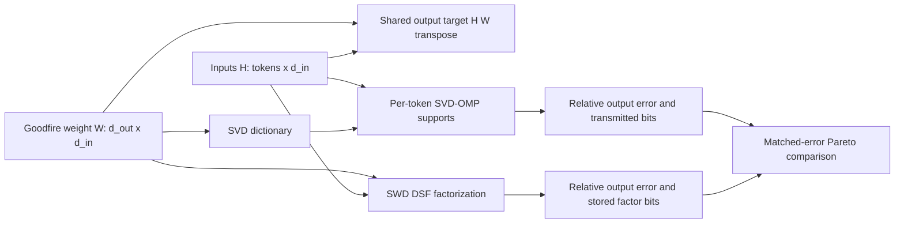

# SVD-OMP versus SWD MDL benchmark

This benchmark compares two different cost models on the same Goodfire weight
matrix and the same calibration activations. It does not claim that SVD-OMP is
the more compact static circuit. SWD owns that axis because its read and write
factors are sparse, while each SVD atom has dense read and write vectors.

## Three-way positioning

| Method | Dictionary and selector | Sparsity unit | Support scope | Calibration or training |
| --- | --- | --- | --- | --- |
| VPD | Learned parameter components and learned causal-importance selector | Components | Intended to vary by input | Training required |
| SVD-OMP | Canonical SVD atoms and analytic `sigma_c * abs(v_c dot phi)` selector | Components with dense read and write vectors | Varies by token | No training |
| SWD | Double Sparse Factorization with sparse read and write factors | Active read and write edges | Fixed per matrix after factorization | Calibration Gram, or identity Gram for zero-data mode |

The static circuit claim belongs to SWD. A single SVD atom costs
`d_in + d_out` active edges, so selecting fewer dense atoms does not make
SVD-OMP competitive on SWD's edge-count axis. The SVD-OMP claim is conditional
and amortized: when the canonical dictionary is already shared, it can transmit
an input-specific support and coefficients without factorization training.



The measured fidelity axis is

```text
relative_error = ||H W^T - H W_hat^T||_F / ||H W^T||_F.
```

For SVD-OMP, every calibration token gets the smallest support that meets a
per-token error target. The plotted x value is then recomputed as the global
relative error above. Supports can differ by token. With rank `r`, support size
`k_n`, and `B` bits per coefficient, the conditional code given a shared SVD
dictionary is

```text
sum_n [log2 choose(r, k_n) + k_n B].
```

The dictionary-counted curve adds

```text
[r d_in + r d_out + r] B.
```

The zero dictionary charge is conditional on the matrix or its canonical SVD
basis already being shared. It is not a claim that an arbitrary decoder can
recover the dictionary for free.

For SWD factors `A` and `B`, with `K_A` and `K_B` measured nonzeros, the code is

```text
log2 choose(d_in m, K_A) + log2 choose(m d_out, K_B)
+ (K_A + K_B) B.
```

Both totals are divided by the number of calibration tokens for the figure.
This leaves the comparison numerically identical to comparing total bits, while
making the amortization explicit. The script refuses to label proxy data as an
SWD result and checks the SWD package's weighted error against a direct output
reconstruction before writing artifacts.

## Initial one-matrix result

The checked-in result uses Goodfire `h.2.mlp.c_fc`, with
`W.shape = [3072, 768]` and `H.shape = [2048, 768]`. `H` comes from the real
`t-9d2b8f02` model on a deterministic seed-0 batch of 16 by 128 random token
IDs. It is not a natural-text calibration corpus.

At 16 bits per stored value, seven measured SWD DSF points, and piecewise-linear
interpolation in log2 total bits, the shared-dictionary curves cross once:

```text
epsilon* = 0.0955168
```

- For measured relative error from `0.0224988` through `epsilon*`, the
  shared-dictionary SVD-OMP code is cheaper.
- From `epsilon*` through the largest measured SWD error `0.3120368`, SWD is
  cheaper.
- The dictionary-counted SVD-OMP code is more expensive throughout the measured
  overlap.

This is a one-matrix random-token result. The threshold is interpolated between
measured SWD points, not itself a DSF run. Exact tensor, benchmark-source, and
repository revisions are recorded in
`results/mdl/mdl_compare.json`.

## Held-out natural-text result across 24 matrices

The follow-up sweep replaces the random token IDs with exact natural-text
activations from the Goodfire run's saved tokenizer. SWD uses 2,048 WikiText-2
train tokens to form its calibration Gram. Every reported distortion and every
SVD-OMP code uses a disjoint set of 2,048 WikiText-2 validation tokens. The
sweep covers all 24 target matrices, 12 feasible SWD sparsities, 40 outer
factorization iterations, and 16-bit stored values.

The result is an architectural split, not global SVD-OMP superiority:

| Matrix family | Shared-dictionary result over measured overlap |
| --- | --- |
| Attention projections | SWD wins throughout on 16 / 16 matrices |
| MLP projections | SVD-OMP wins at the tightest measured errors on 8 / 8 matrices |
| MLP projections | SVD-OMP wins throughout on 6 / 8 matrices |
| MLP `down_proj` exceptions | SVD-OMP wins below `epsilon*=0.25450` in layer 0 and below `epsilon*=0.02768` in layer 1; SWD wins above |
| Dictionary-counted SVD-OMP | No SVD-OMP win on 0 / 24 matrices |

Across the measured error interval, the median matrix-level mean
`log2(bits_SWD / bits_SVD-OMP)` is `-1.371` for attention and `+0.264` for MLP.
The signs mean SWD uses fewer bits for attention while conditional SVD-OMP uses
fewer bits for MLP. These are averages in log-bit space across each matrix's
measured overlap, not single operating-point compression ratios.

This comparison is horizon-dependent. SWD pays a fixed factor code once, while
the SVD-OMP support and coefficient code grows with the number of inputs. If
the held-out per-token rate is held constant, the measured SWD points imply a
median break-even horizon of about 779 tokens for attention and 2,448 tokens
for MLP. The corresponding interquartile ranges are 744 to 830 and 2,216 to
2,670 tokens. This is therefore a short-horizon conditional coding result, not
an asymptotic model-storage result.

Input adaptivity survives natural text: among 256 held-out tokens, the median
matrix produces 253 distinct supports (`0.988` unique-support fraction), with
median paired-support Jaccard `0.284`.

The earlier `epsilon*=0.0955` does not generalize as a model-wide threshold.
Only 2 of 24 held-out matrices have a crossover. Six MLP matrices and all 16
attention matrices have one winner throughout the measured interval. Report
epsilon per matrix only. Do not report the median of the two observed
crossovers as a general threshold.

Exact tensors, hashes, repository revisions, every measured curve, and the
aggregate figure are under `results/mdl_natural_24_final/`.

Reviewer-ready summary:

> On held-out WikiText-2 activations from one 67M transformer, conditional
> shared-dictionary SVD-OMP uses fewer bits than measured SWD at the tightest
> evaluated distortion on all eight MLP projection matrices, and throughout
> the measured overlap on six. SWD uses fewer bits throughout on all sixteen
> attention projections. Counting the SVD dictionary removes every SVD-OMP
> win. This supports a short-horizon, family-conditional rate-distortion
> advantage for MLP matrices, not global method superiority.
