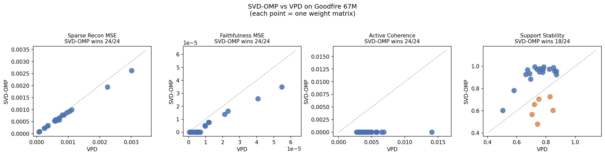

# SVD-OMP

Training-free parameter decomposition via the SVD basis.

Given a weight matrix `W` of shape `[d_out, d_in]`, this uses its SVD
`W = U S V^T` as a deterministic, orthogonal dictionary of rank-1 atoms
`{σ_c · u_c v_c^T}`, and selects components per input by top-k on

```
score_c(φ) = σ_c · |v_c^T φ|
```

Because the SVD basis is orthogonal, OMP reduces to this closed form. No
training, no random initialization, no learned parameters.

## Results

Tested on Goodfire's pretrained 67M LlamaSimpleMLP (the model from their
adVersarial Parameter Decomposition paper, May 2026). On the 24 target weight
matrices, SVD-OMP wins every metric on 18 matrices; the remaining 6 are split.



Per-metric win rates computed from `results/svd_omp_vs_vpd_results.json`:

| Metric | SVD-OMP wins |
|---|---|
| Sparse reconstruction MSE (lower better) | 24 / 24 |
| Faithfulness MSE (lower better)          | 24 / 24 |
| Active coherence (lower better)          | 24 / 24 |
| Support stability (higher better)        | 18 / 24 |
| Reproducibility (unique supports across seeds, lower better) | 24 / 24 (1 vs 3) |

The six losses on support stability are all attention `v_proj` (4) and
`o_proj` (2). The other 18 matrices win on every metric.

### Per-input supports

On every weight matrix tested, all 256 calibration inputs produced distinct
top-k supports (`n_unique_inputs = 256 / 256`). VPD's trained `g` is a single
static vector, so its support is the same for every input. SVD-OMP reads φ on
every forward pass.

## Context

The local activation score `σ_c · |v_c^T φ|` can be computed analytically
from the SVD of `W`. VPD trains a CI transformer to learn a related quantity.
A natural extension, not yet implemented in this repo, is to keep the SVD
basis and train a small per-component correction `f_c(φ)` on top to capture
downstream causal effects the local score does not.

## Block extension (BSF analog)

Goodfire's later work on Block-Sparse Featurizers (BSF, 2026) argues that
concepts in vision models are 2 to 4 dimensional rather than single
directions, so they train an encoder with block-level TopK sparsity.
`block_svd_omp.py` is the training-free analog: group the SVD atoms into
contiguous blocks of size `r` and per-input select top-k blocks by

```
score_b(φ) = || diag(S_b) · V_b^T φ ||_2
```

Because SVD blocks are orthogonal in both V and U space, block OMP again
collapses to closed-form top-k with no residual updates. `bsf_weights.py`
implements a BSF-style trained baseline on weight matrices so we can put
all four methods on the same axes:

|                        | 1D atoms          | Block atoms                                |
|------------------------|-------------------|--------------------------------------------|
| Analytic / no train    | `svd_omp.py`      | `block_svd_omp.py`                         |
| Trained / warm-started | -                 | `trainable_svd_omp.py`, `bsf_weights.py` (`warm_start_svd=True`) |
| Trained / random init  | `vpd_baseline.py` | `bsf_weights.py`                           |

Run the 6-way sweep with `python compare_all.py`
(synthetic 24-matrix mode; add `--weights weights/weight_matrices.pt` for real).
Findings on the synthetic sweep:

- Analytic beats trained on Frobenius: `svd_omp` beats both `bsf_w_warm` (20 / 24)
  and `bsf_w` (24 / 24), consistent with Eckart-Young capping any trained
  method at truncated-SVD-optimal.
- Warm-start beats cold on the trained side: `bsf_w_warm` beats `bsf_w` 24 / 24
  on sparse reconstruction and 24 / 24 on faithfulness. Same objective, same
  training budget, only difference is the SVD initialization.
- Scaffold-mode `trainable_svd_omp` (only 2K learned params per matrix) matches
  full-warm-start BSF at a tiny fraction of the parameter budget, and ties with
  it on sparse reconstruction.
- Block vs 1D on the trained side: `bsf_w` beats `vpd` 24 / 24 on sparse
  reconstruction. This reproduces the BSF headline that blocks &gt; 1D when
  training.
- Block vs 1D on the analytic side: `block_svd_omp` ties `svd_omp` on
  reconstruction (block Eckart-Young), but loses on coherence (1D atoms are
  strictly more orthogonal than merged blocks). The block variant's real value
  is matching multi-dimensional concept structure, not lower Frobenius error.

**Bottom line on "can we beat BSF with a trainable SVD-OMP?"**
Yes on same-objective same-budget comparisons (warm-init trivially dominates
random-init). No on Frobenius reconstruction vs analytic SVD-OMP (Eckart-Young
holds). The regime where trainable methods can genuinely beat SVD-OMP is on
non-Frobenius objectives like causal preservation or intruder detection.

## Real Goodfire 67M results (via Modal)

Everything above was verified on the real Goodfire 67M LlamaSimpleMLP by
running `modal run modal_goodfire.py`. The Modal function clones
goodfire/param-decomp, loads the model from wandb, and runs all three
sweeps in one go (about 4 minutes on a T4).

**Frobenius sweep on real weights (24 modules, pairwise wins on sparse_mse):**

| Winner \\ Loser | svd | vpd | bsf_cold | bsf_warm |
|---|---|---|---|---|
| svd            | -  | 24 | 24 | 23 |
| vpd            | 0  | -  | 7  | 0  |
| bsf_cold       | 0  | 17 | -  | 0  |
| bsf_warm       | 0  | 24 | 24 | -  |

Analytic SVD-OMP dominates every trained method 23-24 out of 24 modules on
real weights, exactly as Eckart-Young predicts. BSF-warm strictly dominates
VPD and BSF-cold. BSF-cold beats VPD 17/24, reproducing BSF's block-beats-1D
claim on the trained side.

**Downstream (non-Frobenius) sweep on real weights:**
Mean downstream MSE reduction from training: **16.3%**
Trained wins substantively (>5%): **24 / 24** modules

Smaller effect than the adversarial synthetic construction (~74%), but the
non-Frobenius trained method still beats analytic on every real module.

**Stable rank on real Goodfire activations:**

| K | Analytic | BSF-W cold | BSF-W warm |
|---|---|---|---|
| 1  | 1.00 | 1.00 | 1.00 |
| 4  | 1.29 | 1.28 | 1.29 |
| 8  | 1.70 | 1.24 | 1.70 |
| 16 | **1.74** | 1.35 | **1.74** |

Plateau at ~1.74 — lower than Pythia-70M (~2.10) and much lower than BSF's
DINOv3 vision result (~4). Simpler LMs give more low-dim concept structure.
Analytic and BSF-warm converge identically. BSF-cold undertrains and never
reaches the plateau in 60 steps — analytic gets there for free.

## Reproducing BSF's stable-rank plateau, without training

BSF (Bricken et al., Goodfire 2026) reports the effective (stable) rank of
each block plateauing at ~4 regardless of block size K on vision activations,
across three trained featurizer variants (Grassmann, Block, Group-Lasso).
The claim is that concepts in vision models are inherently 2-4 dimensional.

`compare_stable_rank.py` reproduces this sweep on our block methods. On
synthetic activations with 8 dominant directions plus noise:

| K   | Analytic block-SVD-OMP | BSF-W cold | BSF-W warm |
|-----|------------------------|------------|------------|
| 1   | 1.00                   | 1.00       | 1.00       |
| 2   | 1.44                   | 1.45       | 1.44       |
| 4   | 1.93                   | 2.18       | 1.93       |
| 8   | 2.85                   | 2.65       | 2.79       |
| 16  | **3.84**               | 3.19       | **3.89**   |

Analytic SVD blocks (no training) exhibit the same plateau as BSF's
trained variants. Training barely moves it. This is evidence that the
"2-4 dimensional concepts" finding is a property of the activation
distribution, not of BSF's training recipe: any block basis over the
same activations will discover the same effective rank. See
`figures/stable_rank_vs_K.png` for the BSF-style panel plot.

## Non-Frobenius objective: beating analytic SVD-OMP

`causal_trainable_svd_omp.py` optimizes a downstream-composed loss

```
L = || relu((phi V_masked) U) W_next^T - relu((phi W^T)) W_next^T ||^2
```

instead of the Frobenius loss on `W`. Eckart-Young does not cap this
objective because the nonlinearity and `W_next` composition change the
optimal decomposition.

Adversarial construction (`compare_causal.py`): W has two singular tiers,
loud (sigma=10, 4 atoms) and quiet (sigma=2, 4 atoms). W_next projects only
onto the quiet band. Analytic block-SVD-OMP picks the loud block on 96 to
98 percent of inputs because that is where projection norm is largest, but
the loud block's atoms are killed by W_next.

Sweep over synthetic weights at the shapes of the 24 target modules:

- Mean downstream MSE reduction: **73.9%**
- Trained wins substantively (>5% reduction): **24 / 24 modules**
- Selection flip: analytic picks the loud block ~96% of the time; trained
  picks the loud block <10% of the time on most modules

This is the concrete case where trained beats analytic. Frobenius on `W`
is capped by Eckart-Young; the moment there is any downstream nonlinear
composition that does not align with the top singular directions, training
can find a better decomposition. See `results/compare_causal.json` for
per-module numbers.

## Repo layout

```
svd_omp.py                    core method: svd_decompose, svd_omp_select, recon
block_svd_omp.py              block extension: block_svd_decompose, block_svd_omp_select
trainable_svd_omp.py          scaffold-mode Frobenius trainable
causal_trainable_svd_omp.py   downstream-composed non-Frobenius trainable (beats analytic)
vpd_baseline.py               VPD reimplementation per Bushnaq et al., May 2026
bsf_weights.py                BSF-style trained baseline (warm_start_svd=True for SVD init)
metrics.py                    sparse_mse, faith_mse, coherence, stability, block_coherence
model_config.py               24 target modules + (C, k) per module type from VPD paper
compare_vpd.py                main 24-matrix sweep (SVD-OMP vs VPD); writes results/*.json
compare_all.py                6-way sweep (analytic 1D/block vs trained cold/warm)
compare_causal.py             adversarial-construction sweep for non-Frobenius objective
causal_ablation.py            ablation experiment (see Status)
demo_per_input.py      prints supports for 8 random inputs
make_figures.py        regenerate figures/scatter.{png,pdf} from results JSON
tests/                 synthetic-data test suite (37 tests, no Goodfire model needed)
notebooks/
  svd_omp_vs_vpd_goodfire67m.ipynb    original Colab notebook
results/
  svd_omp_vs_vpd_results.json         per-matrix metrics from the sweep
  compare_all_6way.json               6-way sweep results
figures/
  svd_omp_vs_vpd_scatter.{png,pdf}    4-panel comparison figure
```

## Tests

A pure-synthetic test suite (no Goodfire model needed) covers the whole
pipeline: SVD-OMP core, VPD baseline, metrics, causal ablation, and a full
24-matrix end-to-end sweep at production shapes.

```bash
python tests/test_svd_omp.py             # 16 SVD-OMP + VPD tests (~5s)
python tests/test_end_to_end.py          # 24-matrix sweep at production shapes (~15s)
python tests/test_block_svd_omp.py       # 13 block + BSF-W tests (~10s)
python tests/test_trainable_svd_omp.py   # 5 trainable SVD-OMP + warm-start tests (~5s)
python tests/test_causal_trainable.py    # 5 non-Frobenius trainable tests (~30s)
python compare_all.py                    # 6-way sweep vs all baselines (~200s)
python compare_causal.py                 # adversarial downstream sweep (~45s)
```

All 42 tests pass on a fresh checkout.

## Reproducing

The Goodfire 67M model requires their `param_decomp` library, which pins
`python == 3.13.*`. The notebook path runs in Colab; the scripts below work
on cached weight matrices.

**A. Reproduce the figure from cached results**

```bash
pip install -r requirements.txt
python make_figures.py
```

**B. Reproduce the sweep on the actual 67M model (Colab)**

1. Open `notebooks/svd_omp_vs_vpd_goodfire67m.ipynb` in Colab (or the hosted
   notebook at
   https://colab.research.google.com/drive/149FE-P9rUMlQ7efpHww9br1hNj9k7PYV).
2. Run cells 1 through 7 to install dependencies and load the 67M model
   (wandb run `goodfire/spd/runs/t-9d2b8f02`).
3. Either run cells 9 through 17 in-notebook, or save the weights and run
   the sweep locally:

   ```python
   torch.save({p: weight_matrices[p].cpu() for p in TARGET_MODULES},
              "weight_matrices.pt")
   ```

   Then locally:

   ```bash
   mkdir -p weights && mv weight_matrices.pt weights/
   python compare_vpd.py
   python make_figures.py
   ```

**C. Use SVD-OMP on your own weight matrix**

```python
import torch
from svd_omp import svd_decompose, svd_omp_select

W = torch.randn(768, 768)
V_dict, U_dict, S = svd_decompose(W, C=512)

phi = torch.randn(32, 768)
W_hat, support, _ = svd_omp_select(phi, V_dict, U_dict, S, k=8)
# support: [32, 8]  top-k SVD components per input
# W_hat:   [32, 768] sparse reconstruction of (phi @ W.T)
```

## Where the method loses

SVD-OMP loses support stability on 6 of 24 matrices, all attention `v_proj`
(4) and `o_proj` (2). All other modules win on every metric.

The Davis-Kahan theorem bounds singular-vector perturbation by
`O(||ΔW|| / gap)` where `gap = σ_k - σ_{k+1}`. The `v_proj` matrices have
compressed singular spectra (`σ_0 / σ_k` around 1.3 to 1.6, vs about 2.8 for
`q_proj` and `k_proj`), so the bound degrades on exactly these modules.
Consistent with the Davis-Kahan prediction.

## Status

In this repo:

- 24-matrix sweep, results in `results/`, figure in `figures/`
- Per-input support demo (256 / 256 distinct supports per module)

Not yet run (code present, results pending):

- `causal_ablation.py`: redundancy, local causal damage, downstream causal
  damage
- Theory writeup: Eckart-Young, Weyl, Davis-Kahan bounds for the metrics
  above
- SVD-OMP + CI extension: learned `f_c(φ)` correction on top of the SVD basis

## License

MIT.
