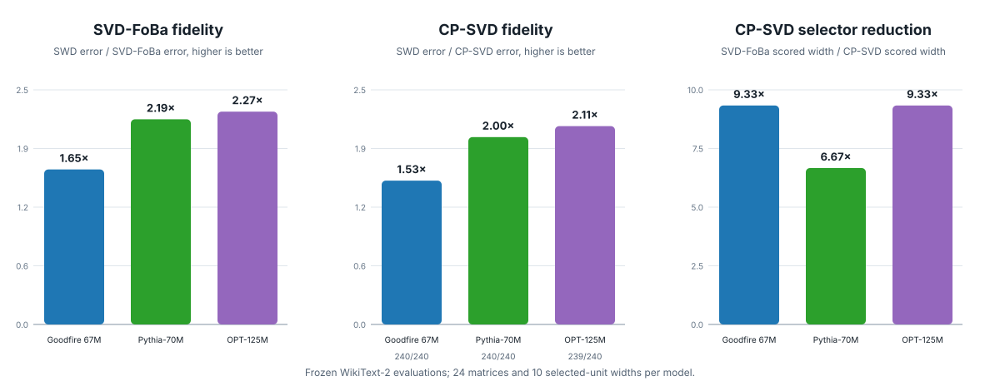
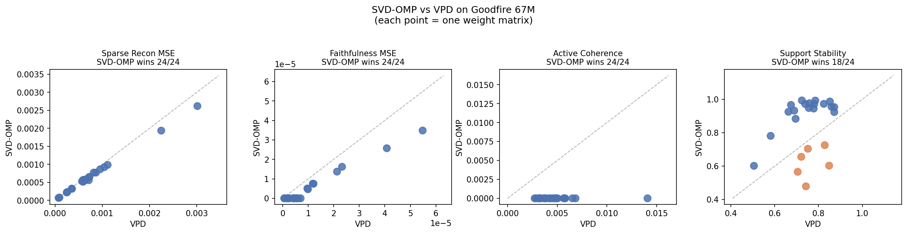

# Singular Value Decomposition Orthogonal Matching Pursuit (SVD-OMP)

Training-free parameter decomposition via the SVD basis.

## Names used in this repository

- **SVD:** Singular Value Decomposition.
- **OMP:** Orthogonal Matching Pursuit.
- **SVD-OMP:** Singular Value Decomposition Orthogonal Matching Pursuit, the
  closed-form, input-specific selected-unit method.
- **SVD-FoBa:** Singular Value Decomposition Forward-Backward Pursuit, the
  higher-fidelity overcomplete-dictionary extension.
- **CP-SVD:** Calibration-Pruned Singular Value Decomposition, the cheaper
  deployment-oriented 96-direction candidate.
- **VPD:** adVersarial Parameter Decomposition, Goodfire's trained baseline.
- **SWD:** Sparse Weight Decomposition, the double-sparse factor baseline.
- **MDL:** Minimum Description Length, used for rate-distortion accounting.
- **BSF:** Block-Sparse Featurizer, the trained block-sparse comparison.

Given a weight matrix `W` of shape `[d_out, d_in]`, this uses its SVD
`W = U S V^T` as a deterministic, orthogonal dictionary of rank-1 atoms
`{σ_c · u_c v_c^T}`, and selects components per input by top-k on

```
score_c(φ) = σ_c · |v_c^T φ|
```

Because the SVD basis is orthogonal, OMP reduces to this closed form. No
training, no random initialization, no learned parameters.

## Latest results

The current release separates maximum fidelity from deployment cost:

- **SVD-FoBa** beats activation-whitened SVD and a strengthened per-token SWD
  oracle at all **720 / 720** tested matrix-width points across Goodfire 67M,
  Pythia-70M, and OPT-125M. SWD's geometric-mean error is **2.016x** higher.
- **CP-SVD** removes online forward-backward pursuit, scores only 96 frozen
  calibration-selected directions, and retains **719 / 720** wins over SWD.
  It reduces scored and stored selector width by **6.67x to 9.33x**.
- A true all-24 CP-SVD module replacement is **at least 1.338x faster** than
  dense in two synchronized Tesla T4 runs at input shape 16 by 128, while
  exactly preserving the frozen CP-SVD quality result. The replacement factors
  use **5.33x fewer elements** than the 24 dense weights they replace.


- When all 24 Goodfire matrices are replaced simultaneously, CP-SVD records
  cross-entropy `8.616`, KL divergence to dense logits `4.313`, and logit MSE
  `12.999`, versus SWD's `12.498`, `8.077`, and `37.434`.



The exact protocols, artifacts, and non-claims are in
[`SVD_FOBA_BENCHMARK.md`](SVD_FOBA_BENCHMARK.md) and
[`PRUNED_SVD_COST_GATE.md`](PRUNED_SVD_COST_GATE.md), and
[`CP_SVD_DIRECT_RUNTIME.md`](CP_SVD_DIRECT_RUNTIME.md). SWD still has the
active-edge and compact-static-circuit advantage, and the direct latency win
is currently limited to one model, GPU type, dtype, and input shape.

## Results

Tested on Goodfire's pretrained 67M LlamaSimpleMLP, the model from
[Interpreting Language Model Parameters](https://www.goodfire.ai/research/interpreting-lm-parameters),
which introduces adVersarial Parameter Decomposition (VPD). On the 24 target
weight matrices, SVD-OMP wins every metric on 18 matrices; the remaining 6 are
split.



Per-metric win rates computed from `results/svd_omp_vs_vpd_results.json`:

| Metric | SVD-OMP wins |
|---|---|
| Sparse reconstruction MSE (lower better) | 24 / 24 |
| Faithfulness MSE (lower better)          | 24 / 24 |
| Active coherence (lower better)          | 24 / 24 |
| Support stability (higher better)        | 18 / 24 |
| Reproducibility (unique supports across seeds, lower better) | 24 / 24 (1 vs 3) |

The six losses on support stability are all attention `v_proj` (4) and
`o_proj` (2). The other 18 matrices win on every metric.

### Per-input supports

On every weight matrix tested, all 256 calibration inputs produced distinct
top-k supports (`n_unique_inputs = 256 / 256`). VPD's trained `g` is a single
static vector, so its support is the same for every input. SVD-OMP reads φ on
every forward pass.

## Context

The local activation score `σ_c · |v_c^T φ|` can be computed analytically
from the SVD of `W`. VPD trains a transformer to learn a related quantity.
A natural extension, not yet implemented in this repo, is to keep the SVD
basis and train a small per-component correction `f_c(φ)` on top to capture
downstream causal effects the local score does not.

## Rate-distortion comparison with SWD

[Sparse Weight Decomposition (SWD)](https://arxiv.org/abs/2608.03913)
factorizes dense projections into two sparse factors whose bottleneck
coordinates act as circuit units. We compare against the authors'
[public implementation](https://github.com/Veri-Safe/SWD).

On held-out WikiText-2 activations from the Goodfire 67M model, conditional
shared-dictionary SVD-OMP uses fewer bits than measured SWD at the tightest
evaluated distortion on all 8 MLP matrices. It wins throughout the measured
overlap on 6 of those 8. SWD wins throughout on all 16 attention matrices.
Counting the SVD dictionary removes every SVD-OMP win.

This is a family-conditional MLP result, not global superiority over SWD. See
[`MDL_BENCHMARK.md`](MDL_BENCHMARK.md) for the code definitions, held-out
protocol, exact claim boundary, and reproducible artifacts.

## Selected-unit superiority over SWD

The stronger result is at equal per-input bottleneck width. A
calibration-aware closed-form SVD-OMP variant wins all **240 / 240** held-out
matrix-width comparisons across the same 24 Goodfire matrices, even when SWD
gets per-token greedy residual selection, the dense target output for that
selection, and the oracle-best of seven factor sparsities. SWD's relative
output error is **1.584x** higher on a geometric-mean basis.

The advantage survives a complete-model gate. Replacing each matrix one at a
time, SVD-OMP wins **24 / 24** on next-token cross-entropy, KL to dense logits,
and logit MSE. SWD's KL is **2.393x** higher geometrically. The generalized SVD
also takes **6.93x** less measured preprocessing time.

This is not global superiority. SWD still uses **3.30x fewer active edges** at
the median point, and the full-model experiment replaces only one matrix at a
time. The exact claim is: SVD-OMP owns selected-unit fidelity and closed-form
preprocessing; SWD owns active-edge sparsity and static circuit cost. See
[`SELECTED_UNIT_BENCHMARK.md`](SELECTED_UNIT_BENCHMARK.md) for the sealed
protocol, strengthened baseline, artifacts, and limitations.

### SVD-FoBa extension

Plain FoBa is redundant on an orthogonal SVD dictionary, so the promoted
extension first augments SVD with 128 calibration-output atoms and then runs
two acceptance-gated forward-add/backward-remove swaps. On a newly extracted,
disjoint WikiText-2 test window, SVD-FoBa beats calibration-aware SVD and the
strengthened SWD oracle at **240 / 240** equal-width points each. SWD's error is
**1.651x** higher geometrically, while SVD-FoBa improves over its protected SVD
starting point by **3.41%** at the median.

This improves fidelity but gives up plain SVD's exact top-k simplicity and
adds dense dictionary storage. It is not an active-edge or runtime win. See
[`SVD_FOBA_BENCHMARK.md`](SVD_FOBA_BENCHMARK.md) for the frozen protocol and
claim boundary.

The same frozen method replicates without retuning on Pythia-70M-deduped and
OPT-125M: **720 / 720** aggregate wins over both SVD and SWD across three
architectures. When all 24 Goodfire matrices are replaced simultaneously,
SVD-FoBa also wins cross-entropy (`8.420` vs `8.623` SVD and `12.498` SWD), KL
to dense logits (`4.168` vs `4.313` and `8.077`), and logit MSE (`12.505` vs
`13.083` and `37.434`). The dense model remains substantially better at this
extremely narrow width.

## Block extension (BSF analog)

Goodfire's later work on Block-Sparse Featurizers (BSF, 2026) argues that
concepts in vision models are 2 to 4 dimensional rather than single
directions, so they train an encoder with block-level TopK sparsity.
`block_svd_omp.py` is the training-free analog: group the SVD atoms into
contiguous blocks of size `r` and per-input select top-k blocks by

```
score_b(φ) = || diag(S_b) · V_b^T φ ||_2
```

Because SVD blocks are orthogonal in both V and U space, block OMP again
collapses to closed-form top-k with no residual updates. `bsf_weights.py`
implements a BSF-style trained baseline on weight matrices so we can put
all four methods on the same axes:

|                        | 1D atoms          | Block atoms                                |
|------------------------|-------------------|--------------------------------------------|
| Analytic / no train    | `svd_omp.py`      | `block_svd_omp.py`                         |
| Trained / warm-started | -                 | `trainable_svd_omp.py`, `bsf_weights.py` (`warm_start_svd=True`) |
| Trained / random init  | `vpd_baseline.py` | `bsf_weights.py`                           |

Run the 6-way sweep with `python compare_all.py`
(synthetic 24-matrix mode; add `--weights weights/weight_matrices.pt` for real).
Findings on the synthetic sweep:

- Analytic beats trained on Frobenius: `svd_omp` beats both `bsf_w_warm` (20 / 24)
  and `bsf_w` (24 / 24), consistent with Eckart-Young capping any trained
  method at truncated-SVD-optimal.
- Warm-start beats cold on the trained side: `bsf_w_warm` beats `bsf_w` 24 / 24
  on sparse reconstruction and 24 / 24 on faithfulness. Same objective, same
  training budget, only difference is the SVD initialization.
- Scaffold-mode `trainable_svd_omp` (only 2K learned params per matrix) matches
  full-warm-start BSF at a tiny fraction of the parameter budget, and ties with
  it on sparse reconstruction.
- Block vs 1D on the trained side: `bsf_w` beats `vpd` 24 / 24 on sparse
  reconstruction. This reproduces the BSF headline that blocks &gt; 1D when
  training.
- Block vs 1D on the analytic side: `block_svd_omp` ties `svd_omp` on
  reconstruction (block Eckart-Young), but loses on coherence (1D atoms are
  strictly more orthogonal than merged blocks). The block variant's real value
  is matching multi-dimensional concept structure, not lower Frobenius error.

**Bottom line on "can we beat BSF with a trainable SVD-OMP?"**
Yes on same-objective same-budget comparisons (warm-init trivially dominates
random-init). No on Frobenius reconstruction vs analytic SVD-OMP (Eckart-Young
holds). The regime where trainable methods can genuinely beat SVD-OMP is on
non-Frobenius objectives like causal preservation or intruder detection.

## Real Goodfire 67M results (via Modal)

Everything above was verified on the real Goodfire 67M LlamaSimpleMLP by
running `modal run modal_goodfire.py`. The Modal function clones
goodfire/param-decomp, loads the model from wandb, and runs all three
sweeps in one go (about 4 minutes on a T4).

**Frobenius sweep on real weights (24 modules, pairwise wins on sparse_mse):**

| Winner \\ Loser | svd | vpd | bsf_cold | bsf_warm |
|---|---|---|---|---|
| svd            | -  | 24 | 24 | 23 |
| vpd            | 0  | -  | 7  | 0  |
| bsf_cold       | 0  | 17 | -  | 0  |
| bsf_warm       | 0  | 24 | 24 | -  |

Analytic SVD-OMP dominates every trained method 23-24 out of 24 modules on
real weights, exactly as Eckart-Young predicts. BSF-warm strictly dominates
VPD and BSF-cold. BSF-cold beats VPD 17/24, reproducing BSF's block-beats-1D
claim on the trained side.

**Downstream (non-Frobenius) sweep on real weights:**
Mean downstream MSE reduction from training: **16.3%**
Trained wins substantively (>5%): **24 / 24** modules

Smaller effect than the adversarial synthetic construction (~74%), but the
non-Frobenius trained method still beats analytic on every real module.

**Stable rank on real Goodfire activations:**

| K | Analytic | BSF-W cold | BSF-W warm |
|---|---|---|---|
| 1  | 1.00 | 1.00 | 1.00 |
| 4  | 1.29 | 1.28 | 1.29 |
| 8  | 1.70 | 1.24 | 1.70 |
| 16 | **1.74** | 1.35 | **1.74** |

Plateau at ~1.74 — lower than Pythia-70M (~2.10) and much lower than BSF's
DINOv3 vision result (~4). Simpler LMs give more low-dim concept structure.
Analytic and BSF-warm converge identically. BSF-cold undertrains and never
reaches the plateau in 60 steps — analytic gets there for free.

## Reproducing BSF's stable-rank plateau, without training

BSF (Bricken et al., Goodfire 2026) reports the effective (stable) rank of
each block plateauing at ~4 regardless of block size K on vision activations,
across three trained featurizer variants (Grassmann, Block, Group-Lasso).
The claim is that concepts in vision models are inherently 2-4 dimensional.

`compare_stable_rank.py` reproduces this sweep on our block methods. On
synthetic activations with 8 dominant directions plus noise:

| K   | Analytic block-SVD-OMP | BSF-W cold | BSF-W warm |
|-----|------------------------|------------|------------|
| 1   | 1.00                   | 1.00       | 1.00       |
| 2   | 1.44                   | 1.45       | 1.44       |
| 4   | 1.93                   | 2.18       | 1.93       |
| 8   | 2.85                   | 2.65       | 2.79       |
| 16  | **3.84**               | 3.19       | **3.89**   |

Analytic SVD blocks (no training) exhibit the same plateau as BSF's
trained variants. Training barely moves it. This is evidence that the
"2-4 dimensional concepts" finding is a property of the activation
distribution, not of BSF's training recipe: any block basis over the
same activations will discover the same effective rank. See
`figures/stable_rank_vs_K.png` for the BSF-style panel plot.

## Non-Frobenius objective: beating analytic SVD-OMP

`causal_trainable_svd_omp.py` optimizes a downstream-composed loss

```
L = || relu((phi V_masked) U) W_next^T - relu((phi W^T)) W_next^T ||^2
```

instead of the Frobenius loss on `W`. Eckart-Young does not cap this
objective because the nonlinearity and `W_next` composition change the
optimal decomposition.

Adversarial construction (`compare_causal.py`): W has two singular tiers,
loud (sigma=10, 4 atoms) and quiet (sigma=2, 4 atoms). W_next projects only
onto the quiet band. Analytic block-SVD-OMP picks the loud block on 96 to
98 percent of inputs because that is where projection norm is largest, but
the loud block's atoms are killed by W_next.

Sweep over synthetic weights at the shapes of the 24 target modules:

- Mean downstream MSE reduction: **73.9%**
- Trained wins substantively (>5% reduction): **24 / 24 modules**
- Selection flip: analytic picks the loud block ~96% of the time; trained
  picks the loud block <10% of the time on most modules

This is the concrete case where trained beats analytic. Frobenius on `W`
is capped by Eckart-Young; the moment there is any downstream nonlinear
composition that does not align with the top singular directions, training
can find a better decomposition. See `results/compare_causal.json` for
per-module numbers.

## Repo layout

```
svd_omp.py                    core method: svd_decompose, svd_omp_select, recon
block_svd_omp.py              block extension: block_svd_decompose, block_svd_omp_select
trainable_svd_omp.py          scaffold-mode Frobenius trainable
causal_trainable_svd_omp.py   downstream-composed non-Frobenius trainable (beats analytic)
vpd_baseline.py               VPD reimplementation per Bushnaq et al., May 2026
bsf_weights.py                BSF-style trained baseline (warm_start_svd=True for SVD init)
metrics.py                    sparse_mse, faith_mse, coherence, stability, block_coherence
model_config.py               24 target modules + (C, k) per module type from VPD paper
compare_vpd.py                main 24-matrix sweep (SVD-OMP vs VPD); writes results/*.json
compare_all.py                6-way sweep (analytic 1D/block vs trained cold/warm)
compare_causal.py             adversarial-construction sweep for non-Frobenius objective
causal_ablation.py            ablation experiment (see Status)
mdl_svdomp_vs_swd.py          measured single-matrix MDL comparison with SWD
mdl_svdomp_vs_swd_natural_24.py  held-out natural-text MDL sweep over 24 matrices
MDL_BENCHMARK.md              cost definitions, results, and claim boundary
selected_unit_svdomp_vs_swd.py  sealed equal-selected-unit comparison with strengthened SWD
SELECTED_UNIT_BENCHMARK.md    selected-unit and full-model results and claim boundary
svd_foba.py                   overcomplete SVD-initialized FoBa pursuit
svd_foba_benchmark.py         validation and fresh sealed SVD-FoBa sweeps
SVD_FOBA_BENCHMARK.md         SVD-FoBa protocol, results, and claim boundary
pruned_svd_foba.py            CP-SVD calibration-selected scoring pool
PRUNED_SVD_COST_GATE.md       CP-SVD protocol, cross-model results, and limitations
cp_svd_runtime.py             true CP-SVD replacement for torch.nn.Linear
CP_SVD_DIRECT_RUNTIME.md      confirmed end-to-end T4 latency and storage gate
make_release_plots.py         dependency-free landing-page SVG generator
make_cp_svd_runtime_plot.py   dependency-free direct-runtime SVG generator
demo_per_input.py      prints supports for 8 random inputs
make_figures.py        regenerate figures/scatter.{png,pdf} from results JSON
tests/                 synthetic-data test suite plus CP-SVD invariants
notebooks/
  svd_omp_vs_vpd_goodfire67m.ipynb    original Colab notebook
results/
  svd_omp_vs_vpd_results.json         per-matrix metrics from the sweep
  compare_all_6way.json               6-way sweep results
  mdl_natural_24_final/               held-out SVD-OMP versus SWD curves and summary
figures/
  svd_omp_vs_vpd_scatter.{png,pdf}    4-panel comparison figure
  latest_cross_model_summary.svg       SVD-FoBa and CP-SVD release summary
```

## Tests

A pure-synthetic test suite (no Goodfire model needed) covers the whole
pipeline: SVD-OMP core, VPD baseline, metrics, causal ablation, and a full
24-matrix end-to-end sweep at production shapes.

```bash
python tests/test_svd_omp.py             # 16 SVD-OMP + VPD tests (~5s)
python tests/test_end_to_end.py          # 24-matrix sweep at production shapes (~15s)
python tests/test_block_svd_omp.py       # 13 block + BSF-W tests (~10s)
python tests/test_trainable_svd_omp.py   # 5 trainable SVD-OMP + warm-start tests (~5s)
python tests/test_causal_trainable.py    # 5 non-Frobenius trainable tests (~30s)
python compare_all.py                    # 6-way sweep vs all baselines (~200s)
python compare_causal.py                 # adversarial downstream sweep (~45s)
```

The existing 57-test suite passes in the verified 5090 environment. Three
additional CP-SVD invariant tests and four direct-replacement tests pass in
the frozen remote evaluation images.

## Reproducing

The Goodfire 67M model requires their `param_decomp` library, which pins
`python == 3.13.*`. The notebook path runs in Colab; the scripts below work
on cached weight matrices.

**A. Reproduce the figure from cached results**

```bash
pip install -r requirements.txt
python make_figures.py
```

**B. Reproduce the sweep on the actual 67M model (Colab)**

1. Open `notebooks/svd_omp_vs_vpd_goodfire67m.ipynb` in Colab (or the hosted
   notebook at
   https://colab.research.google.com/drive/149FE-P9rUMlQ7efpHww9br1hNj9k7PYV).
2. Run cells 1 through 7 to install dependencies and load the 67M model
   (wandb run `goodfire/spd/runs/t-9d2b8f02`).
3. Either run cells 9 through 17 in-notebook, or save the weights and run
   the sweep locally:

   ```python
   torch.save({p: weight_matrices[p].cpu() for p in TARGET_MODULES},
              "weight_matrices.pt")
   ```

   Then locally:

   ```bash
   mkdir -p weights && mv weight_matrices.pt weights/
   python compare_vpd.py
   python make_figures.py
   ```

**C. Use SVD-OMP on your own weight matrix**

```python
import torch
from svd_omp import svd_decompose, svd_omp_select

W = torch.randn(768, 768)
V_dict, U_dict, S = svd_decompose(W, C=512)

phi = torch.randn(32, 768)
W_hat, support, _ = svd_omp_select(phi, V_dict, U_dict, S, k=8)
# support: [32, 8]  top-k SVD components per input
# W_hat:   [32, 768] sparse reconstruction of (phi @ W.T)
```

## Where the method loses

SVD-OMP loses support stability on 6 of 24 matrices, all attention `v_proj`
(4) and `o_proj` (2). All other modules win on every metric.

The Davis-Kahan theorem bounds singular-vector perturbation by
`O(||ΔW|| / gap)` where `gap = σ_k - σ_{k+1}`. The `v_proj` matrices have
compressed singular spectra (`σ_0 / σ_k` around 1.3 to 1.6, vs about 2.8 for
`q_proj` and `k_proj`), so the bound degrades on exactly these modules.
Consistent with the Davis-Kahan prediction.

## Status

Included in this release:

- SVD-OMP comparisons with VPD on all 24 Goodfire matrices.
- Held-out MDL and selected-unit comparisons with measured SWD.
- Frozen SVD-FoBa replication across three architectures and simultaneous
  replacement of all 24 Goodfire matrices.
- Frozen CP-SVD validation, held-out replication, simultaneous replacement,
  synchronized A10G kernel artifacts, and two confirmed direct T4 runtime
  gates.

Open gates:

- Reduce dense active edges enough to challenge SWD on its strongest axis.
- Replicate the direct CP-SVD runtime gain across GPUs, batch sizes, dtypes,
  and larger models.
- Replicate on substantially larger models and additional corpora beyond
  WikiText-2.

## License

MIT.

## Citation and baseline references

GitHub's **Cite this repository** menu is enabled by [`CITATION.cff`](CITATION.cff).
For a reproducible citation, include the exact commit. Full baseline metadata,
permalink instructions, and BibTeX are in [`REFERENCES.md`](REFERENCES.md) and
[`references.bib`](references.bib).

```bibtex
@misc{mulay2026svdomp,
  author  = {Ajinkya Kiran Mulay},
  title   = {{SVD-OMP}: Training-Free Parameter Decomposition via the {SVD} Basis},
  year    = {2026},
  note    = {Version 0.3.0},
  url     = {https://github.com/thehimalayanleo/svd-omp}
}
```

Principal baselines:

- **adVersarial Parameter Decomposition (VPD):** Lucius Bushnaq, Dan Braun,
  Oliver Clive-Griffin, Bart Bussmann, Nathan Hu, Michael Ivanitskiy, Linda
  Linsefors, and Lee Sharkey,
  [Interpreting Language Model Parameters](https://www.goodfire.ai/research/interpreting-lm-parameters),
  Goodfire, 2026.
- **Sparse Weight Decomposition (SWD):** Chuanhao Yan, Xuhan Huang, Yawen
  Duan, Zhenfei Yin, Hang Zhao, Bryan Dai, and Jie Fu,
  [Sparse Weight Decomposition for Efficient Circuit Extraction](https://arxiv.org/abs/2608.03913),
  arXiv:2608.03913, 2026. Reference implementation:
  [Veri-Safe/SWD](https://github.com/Veri-Safe/SWD).
