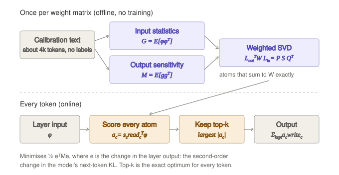
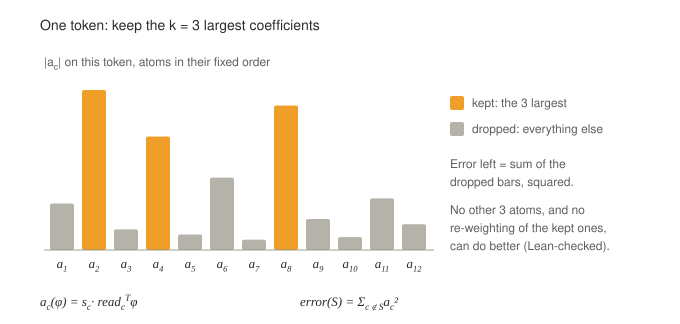
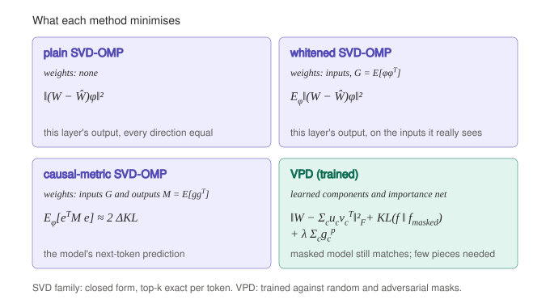
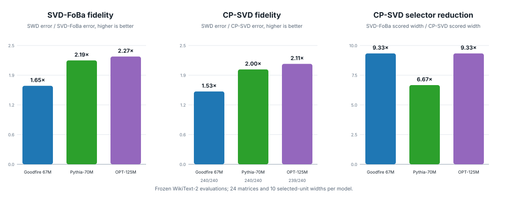

# SVD-OMP

SVD-OMP (Singular Value Decomposition Orthogonal Matching Pursuit) writes what one
weight matrix does on each token as a sum of a few rank-one pieces of its own SVD.
Nothing is trained: no parameters are fitted by gradient descent. A weighted SVD
gives the pieces once per matrix, and a top-k sort picks the pieces for each token.
That sort is the exact optimum for the error the weighting defines. The weighting
comes from measurements on a little calibration text: plain SVD-OMP needs none,
whitened SVD-OMP needs forward passes, and causal-metric SVD-OMP also needs backward
passes to measure gradients. Gradients are only measured, never followed.

## How it works

**1. Build the atoms once, then keep a few per token.** Causal-metric SVD-OMP needs
about 4k tokens of unlabelled calibration text, a few dozen forward and backward
passes over it, and one SVD per matrix.



**2. Picking is a sort.** The atoms are orthonormal in the chosen geometry, so the
error of a kept set is exactly the energy of the dropped atoms.



**3. The variants differ only in what "error" means.** Plain SVD-OMP weights nothing,
whitened SVD-OMP weights inputs by real activations, and causal-metric SVD-OMP also
weights outputs by the next-token Fisher metric.



### The per-token loss

With $L_{\text{out}}^{\top} W L_{\text{in}} = P S Q^{\top}$,
$a_c(\phi) = s_c\,\text{read}_c^{\top}\phi$ and $M = L_{\text{out}} L_{\text{out}}^{\top}$,
keeping a set $S$ of $k$ atoms on token $\phi$ costs

$$
\tfrac12\, e_S^{\top} M\, e_S \;=\; \tfrac12 \sum_{c \notin S} a_c(\phi)^2,
\qquad e_S = W\phi - \sum_{c \in S} a_c(\phi)\,\text{write}_c ,
$$

so the $k$ largest $|a_c(\phi)|$ are the exact optimum. For causal-metric SVD-OMP,
$M$ is the Fisher metric of the next-token distribution, so this cost is the
second-order change in KL to the dense model. Whitened SVD-OMP uses $M = I$.
Plain SVD-OMP also drops the input weighting ($L_{\text{in}} = I$).

Lean 4 with Mathlib checks these statements ([`lean/THEOREMS.md`](lean/THEOREMS.md)).
They explain why selection needs no training. They do not compare SVD-OMP with VPD,
which learns a different dictionary. [`docs/METHODS.md`](docs/METHODS.md) puts the
maths of every method side by side.

## Methods in this repository

| Name | What it does | Code |
|---|---|---|
| SVD-OMP | Top-k over weighted-SVD atoms. The atoms sum to `W` exactly. The whitened variant is called calibration-aware SVD-OMP in the benchmark docs. | `svd_omp.py` (plain), `svd_foba.calibration_aware_svd_factors` (whitened) |
| Causal-metric SVD-OMP | Also weights the output side by the Fisher metric, estimated from gradients of sampled labels. Top-k is then exact for the second-order change in the model's next-token KL. | `causal_svd_omp.py` (`sensitivity_metric`, `causal_whitened_svd`, `select_top_k`) |
| SVD-FoBa | SVD-OMP atoms plus 128 calibration output atoms, refined per token by two forward-backward swaps. Best output fit, but no longer a decomposition of `W`. | `svd_foba.py` |
| CP-SVD | Calibration-Pruned SVD. Keeps 96 SVD directions chosen on calibration data and takes the top-k per token, with no swaps. | `pruned_svd_foba.py`, `cp_svd_runtime.py` |

The two baselines are Goodfire's adVersarial Parameter Decomposition (VPD), which is
trained, and Sparse Weight Decomposition (SWD), which factors each matrix into two
sparse factors.

## Results

All results are on held-out WikiText-2 tokens. The SWD control is stronger than
published SWD. It picks units per token with greedy selection that sees the dense
target output, and each point takes the best of seven factor sparsities. That makes
it an evaluation oracle, not a selector SWD could deploy.

| Result | Scope | Source |
|---|---|---|
| SVD-FoBa has lower output error than whitened SVD-OMP and than SWD at 720 / 720 matrix-width points. SWD's error is 2.016x higher (geometric mean). | Goodfire 67M, Pythia-70M-deduped, OPT-125M. 24 matrices and 10 widths per model. | [SVD-FoBa benchmark](SVD_FOBA_BENCHMARK.md) |
| CP-SVD keeps lower error than SWD at 719 / 720 points, with one miss on OPT-125M. It scores 6.67x to 9.33x fewer directions than SVD-FoBa. | Same three models. | [CP-SVD cost gate](PRUNED_SVD_COST_GATE.md) |
| With all 24 Goodfire matrices replaced at once, next-token cross-entropy is 8.420 for SVD-FoBa, 8.616 for CP-SVD and 12.498 for SWD. The dense model gets 4.481. | Goodfire 67M. | [SVD-FoBa benchmark](SVD_FOBA_BENCHMARK.md), [CP-SVD cost gate](PRUNED_SVD_COST_GATE.md) |
| A direct CP-SVD module replacement is at least 1.338x faster than dense and reproduces the frozen CP-SVD quality numbers exactly. Its factors hold 5.33x fewer elements than the 24 dense weights they replace. | Goodfire 67M, two runs on one Tesla T4, float32, input of 16 by 128 tokens. | [CP-SVD runtime](CP_SVD_DIRECT_RUNTIME.md) |
| Whitened SVD-OMP alone has lower output error than SWD at 240 / 240 points. It also wins cross-entropy, KL to dense logits, and logit MSE in 24 / 24 one-matrix-at-a-time replacements. | Goodfire 67M. | [Selected-unit benchmark](SELECTED_UNIT_BENCHMARK.md) |

SWD wins on other axes:

- SWD uses 3.30x fewer active edges (median). Its read and write vectors are sparse, and SVD atoms have dense ones.
- Counted in bits, SWD is cheaper on all 16 attention matrices. If the SVD dictionary is assumed already shared, SVD-OMP is cheaper on 8 / 8 MLP matrices at the tightest errors. Counting the dictionary removes every SVD-OMP win ([MDL benchmark](MDL_BENCHMARK.md)).



## Quickstart

Install the dependencies and run the core tests. They use synthetic matrices and do
not need the Goodfire model.

```bash
git clone https://github.com/thehimalayanleo/svd-omp
cd svd-omp
pip install -r requirements.txt pytest
python -m pytest tests/test_svd_omp.py tests/test_svd_foba.py tests/test_pruned_svd_foba.py tests/test_cp_svd_runtime.py
```

Decompose your own weight matrix:

```python
import torch
from svd_omp import svd_decompose, svd_omp_select
from svd_foba import calibration_aware_svd_factors

W = torch.randn(768, 768)    # weight, shape [d_out, d_in]
phi = torch.randn(32, 768)   # layer inputs, one row per token

# Plain SVD-OMP.
V_dict, U_dict, S = svd_decompose(W, C=512)
W_hat, support, _ = svd_omp_select(phi, V_dict, U_dict, S, k=8)
# support: [32, 8] atoms kept per token. W_hat: [32, 768] approximation of phi @ W.T.

# Whitened SVD-OMP, using real layer inputs as calibration data.
calibration = torch.randn(2048, 768)
write, s, read = calibration_aware_svd_factors(W, calibration, alpha=0.1)
a = (phi @ read) * s
keep = a.abs().topk(8, dim=1).indices
y_hat = torch.zeros_like(a).scatter_(1, keep, a.gather(1, keep)) @ write.T
```

To reproduce a benchmark, open its doc. Each one lists its script, frozen
configuration, and result files. The Goodfire experiments need the model's weights
([`scripts/save_goodfire_weights.py`](scripts/save_goodfire_weights.py)). The
cross-model and runtime gates run on Modal (`modal_*.py`).

To check the Lean proofs:

```bash
cd lean && lake update && lake exe cache get && lake build && lake env lean Axioms.lean
```

## Documentation

- [`docs/METHODS.md`](docs/METHODS.md). The maths of plain, whitened and causal-metric SVD-OMP, SVD-FoBa, and VPD, with an [interactive toy](docs/svd_omp_toy.html) of the selection rule.
- [`lean/THEOREMS.md`](lean/THEOREMS.md). The Lean-checked theorems and what they do not cover.
- [`SVD_FOBA_BENCHMARK.md`](SVD_FOBA_BENCHMARK.md). SVD-FoBa protocol, cross-model replication, and simultaneous replacement.
- [`PRUNED_SVD_COST_GATE.md`](PRUNED_SVD_COST_GATE.md). CP-SVD selection rule, fidelity, cost, and latency.
- [`CP_SVD_DIRECT_RUNTIME.md`](CP_SVD_DIRECT_RUNTIME.md). The direct T4 runtime gate.
- [`SELECTED_UNIT_BENCHMARK.md`](SELECTED_UNIT_BENCHMARK.md). Whitened SVD-OMP against SWD at equal selected units.
- [`MDL_BENCHMARK.md`](MDL_BENCHMARK.md). Minimum description length (bits) comparison with SWD.
- [`docs/RESULTS_ARCHIVE.md`](docs/RESULTS_ARCHIVE.md). Older results that used to be in this README: the comparison with our simplified VPD reimplementation, the block-sparse (BSF) extension, stable rank, the non-Frobenius objective, and the full file list.
- [`REFERENCES.md`](REFERENCES.md). Baseline papers and how to cite benchmark claims.

## Limitations

- SWD owns active-edge sparsity and static circuit cost. Selecting fewer dense SVD atoms does not change that.
- Every result is on 67M to 125M decoder-only models and WikiText-2.
- The speedup is measured on one model, one GPU type, one dtype, and one input shape.
- No sparse method here comes close to dense-model quality at the tested widths.
- SVD-FoBa adds 128 dense atoms per matrix and gives up the exact sum to `W`.
- Supports are least stable on attention `v_proj` and `o_proj`. On the Goodfire 67M weights, they hold the eight lowest support-stability scores in `results/svd_omp_vs_vpd_results.json` (0.48 to 0.78, against 0.88 or more elsewhere). Their singular spectra are compressed, which is consistent with the Davis-Kahan bound.
- Causal-metric SVD-OMP has code and unit tests here (`causal_svd_omp.py`), but no released benchmark yet. The results above use plain SVD-OMP, whitened SVD-OMP, SVD-FoBa, and CP-SVD.
- This repository does not compare against Goodfire's released VPD. The older VPD numbers in the [results archive](docs/RESULTS_ARCHIVE.md) are against our simplified reimplementation (`vpd_baseline.py`, with 200 training steps and one static gate vector per matrix). Frobenius wins there follow from Eckart-Young. A pre-registered comparison with Goodfire's released VPD checkpoint is in progress.

## Citation

Use GitHub's **Cite this repository** menu, which reads [`CITATION.cff`](CITATION.cff),
and include the exact commit. Baseline BibTeX is in [`REFERENCES.md`](REFERENCES.md)
and [`references.bib`](references.bib).

```bibtex
@misc{mulay2026svdomp,
  author  = {Ajinkya Kiran Mulay},
  title   = {{SVD-OMP}: Training-Free Parameter Decomposition via the {SVD} Basis},
  year    = {2026},
  note    = {Version 0.3.0},
  url     = {https://github.com/thehimalayanleo/svd-omp}
}
```

Principal baselines:

- **VPD.** Lucius Bushnaq, Dan Braun, Oliver Clive-Griffin, Bart Bussmann, Nathan Hu,
  Michael Ivanitskiy, Linda Linsefors, and Lee Sharkey,
  [Interpreting Language Model Parameters](https://www.goodfire.ai/research/interpreting-lm-parameters),
  Goodfire, 2026.
- **SWD.** Chuanhao Yan, Xuhan Huang, Yawen Duan, Zhenfei Yin, Hang Zhao, Bryan Dai,
  and Jie Fu,
  [Sparse Weight Decomposition for Efficient Circuit Extraction](https://arxiv.org/abs/2608.03913),
  arXiv:2608.03913, 2026. Reference implementation:
  [Veri-Safe/SWD](https://github.com/Veri-Safe/SWD).

## License

MIT. See [`LICENSE`](LICENSE).
