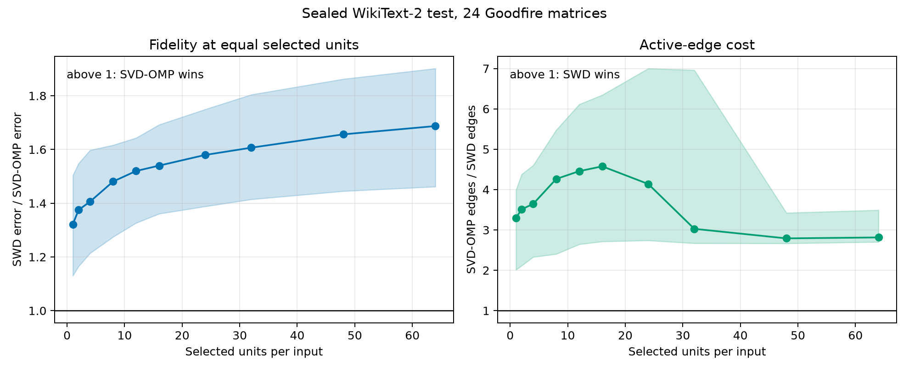

# Calibration-aware SVD-OMP versus SWD at equal selected units

This benchmark tests the axis on which SVD-OMP is structurally strongest:
fidelity when only `k` latent units may be selected for each input. It does not
claim that SVD-OMP is the sparsest static circuit. SWD retains that advantage
because its read and write vectors are sparse while SVD-OMP's are dense.

## Method

The promoted variant is calibration-aware SVD-OMP. For a weight matrix `W` and
calibration inputs `H`, form

```text
G_alpha = H^T H / n + alpha * mean(diag(H^T H / n)) * I
G_alpha = L L^T
W L = U Sigma V^T.
```

The output atoms are the columns of `U`, and the corresponding read vectors are
`L^-T V`. For an input `h`, component coefficients are

```text
c = (h L^-T V) * Sigma.
```

Since the output atoms remain orthogonal, the exact best `k`-unit
reconstruction in this basis is obtained by selecting the `k` largest values
of `abs(c)`. The decomposition is closed-form and has no learned selector,
random initialization, or iterative optimization. `alpha=0.1` was selected on
WikiText-2 validation activations and frozen before the test split was
extracted.

## Strengthened SWD control

The comparison is intentionally harder than standard fixed-support SWD. For
each held-out token and each `k`, SWD receives greedy residual selection over
all of its factorized contributions. This selection sees the dense target
output and chooses up to `k` SWD units for that token. For every matrix and
every `k`, the reported SWD result is additionally the oracle-best result over
seven predeclared factor sparsities:

```text
0.30, 0.45, 0.58, 0.69, 0.76, 0.81, 0.82
```

Each factorization uses 40 outer DSF iterations. This gives SWD input-specific
selection even though the published method uses a fixed factor support. It is
an evaluation oracle, not a deployable SWD selector, because it uses the dense
target output when choosing units.

## Sealed protocol

- Model: Goodfire 67M LlamaSimpleMLP, run `t-9d2b8f02`.
- Matrices: all 24 attention and MLP projections across four layers.
- Calibration: 2,048 WikiText-2 train tokens.
- Test: 2,048 disjoint WikiText-2 test tokens.
- Selected units: `1, 2, 4, 8, 12, 16, 24, 32, 48, 64`.
- Frozen before test extraction: `alpha`, selected-unit grid, SWD sparsity grid,
  factorization iterations, scoring rules, and aggregation.
- Test activation SHA-256:
  `219b97018302887d1a41d7e119489e6b48d2428f5449e897430e9b9884659626`.

The primary matrix metric is held-out relative output error:

```text
||H_test W^T - Y_hat||_F / ||H_test W^T||_F.
```

## Results

| Gate | Result |
| --- | ---: |
| Matrix-by-width relative output error | SVD-OMP wins 240 / 240 |
| Geometric mean `SWD error / SVD-OMP error` | 1.584x |
| Minimum `SWD error / SVD-OMP error` | 1.025x |
| Attention points | SVD-OMP wins 160 / 160 |
| MLP points | SVD-OMP wins 80 / 80 |
| Measured preprocessing time | SWD / SVD-OMP median 6.93x |
| Active-edge cost | SVD-OMP / SWD median 3.30x |

The fidelity advantage grows rather than disappears with width: the median
SWD-to-SVD error ratio rises from `1.321x` at `k=1` to `1.687x` at `k=64`.



## Full-model downstream gate

For the native Goodfire widths, `k=8` is used for query and key projections and
`k=12` for the other projections. Each of the 24 matrices is replaced one at a
time in the complete language model, with all other matrices left dense. The
same frozen WikiText-2 test tokens are evaluated against the dense model.

| Full-model metric | Result |
| --- | ---: |
| Next-token cross-entropy | SVD-OMP wins 24 / 24 |
| KL divergence to dense logits | SVD-OMP wins 24 / 24 |
| Logit MSE | SVD-OMP wins 24 / 24 |
| Geometric mean `SWD KL / SVD-OMP KL` | 2.393x |
| Minimum `SWD KL / SVD-OMP KL` | 1.254x |
| Geometric mean `SWD logit MSE / SVD-OMP logit MSE` | 2.745x |

This is a single-matrix replacement test, not a simultaneous replacement of
all 24 matrices and not evidence about interpretability or causal concepts.

## Exact claim boundary

Supported:

> At equal per-input selected-unit width on one 67M transformer,
> calibration-aware closed-form SVD-OMP has lower held-out output error than a
> strengthened per-token greedy SWD oracle at all 240 matrix-width points. It
> also better preserves complete-model logits and next-token cross-entropy for
> all 24 single-matrix replacements, while requiring 6.9x less measured
> decomposition time.

Not supported:

- Global superiority over SWD.
- Lower active-edge count or smaller static circuit storage.
- Simultaneous sparse replacement of the complete model.
- Better interpretability, causal fidelity, or feature quality.
- Generalization beyond this model and dataset without replication.

SWD wins the active-edge objective by a median factor of `3.30x`. The clean
positioning is therefore a Pareto split: SVD-OMP owns selected-unit fidelity
and closed-form preprocessing; SWD owns edge sparsity and static circuit cost.

## Artifacts

- Sealed matrix result: `results/selected_units/sealed_test.json`
- Full-model result: `results/selected_units/selected_unit_model_eval.json`
- Aggregate summary: `results/selected_units/final/summary.json`
- Point table: `results/selected_units/final/points.csv`
- Matrix benchmark: `selected_unit_svdomp_vs_swd.py`
- Full-model evaluator: `modal_selected_unit_model_eval.py`
- Reproducible summarizer: `summarize_selected_unit_results.py`

The full-model result SHA-256 is
`72d8275cdb73356becc790d31e0f751d59faf68f06619f2821f85ff414156b91`.
