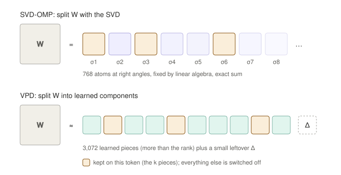
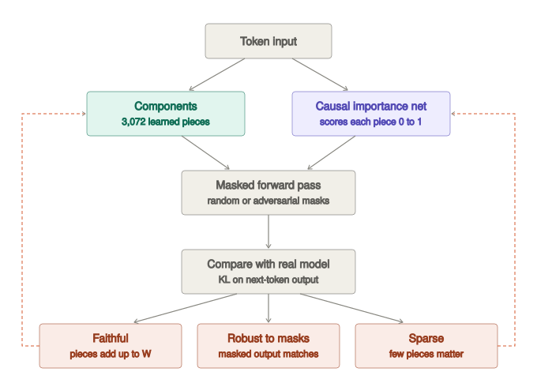

# How SVD-OMP, its variants, SVD-FoBa and VPD relate

All of these explain one weight matrix $W$ (shape $m \times n$) on each token as a
sum of a few rank-one pieces. They differ in where the pieces come from and how the
few are chosen.

## The SVD family is one recipe

Weight the space, factor it, map back, keep the top $k$ per token:

$$
L_{\text{out}}^{\top} W L_{\text{in}} = P\,S\,Q^{\top},\qquad
\text{read}_c = L_{\text{in}}^{-\top} q_c,\qquad
\text{write}_c = L_{\text{out}}^{-\top} p_c
$$

$$
W\phi = \sum_c a_c(\phi)\,\text{write}_c,\qquad
a_c(\phi) = s_c\,\text{read}_c^{\top}\phi,\qquad
S(\phi) = \operatorname{top}_k\, |a_c(\phi)|
$$

The write vectors are orthonormal in the chosen output geometry, so the error of any
support is the sum of the dropped $a_c^2$. Top-k is therefore exact, with no greedy
search and no training, and every variant sums back to $W$ exactly. These statements
are proved in Lean; see [`lean/THEOREMS.md`](../lean/THEOREMS.md).

| Method | Input weight | Output weight | Minimises (per token) | Data needed |
|---|---|---|---|---|
| plain SVD-OMP | identity | identity | layer output error | none |
| whitened SVD-OMP | Cholesky of the input Gram | identity | layer output error, atoms ordered for real inputs | input Gram |
| causal-metric SVD-OMP | Cholesky of the input Gram | Cholesky of the Fisher metric | output error weighted by the next-token distribution | input Gram and Fisher |

Plain SVD-OMP is $W = U\Sigma V^{\top}$ with score $\sigma_c\,|v_c^{\top}\phi|$.
Whitened SVD-OMP takes $L_{\text{in}}L_{\text{in}}^{\top} = \mathbb{E}[\phi\phi^{\top}]$
and minimises $\mathbb{E}_\phi\,\|(W-\hat W)\phi\|^2$. Causal-metric SVD-OMP also takes
$L_{\text{out}}L_{\text{out}}^{\top} = M = \mathbb{E}[g g^{\top}]$, where
$g = \nabla_{\text{out}} \log p(\tilde y)$ for a sampled label $\tilde y$, and minimises
$\mathbb{E}_\phi[e^{\top} M e]$ with $e = (W - \hat W)\phi$. That is about twice the
increase in KL to the dense model, because $M$ is the Gauss-Newton (Fisher) metric.

## SVD-FoBa

The dictionary $D$ is the calibration-aware SVD atoms plus 128 calibration output atoms.
Each token solves

$$
\min_{|S| = k,\; x}\ \|W\phi - D_S x\|^2 + \lambda \|x\|^2
$$

by forward and backward swaps, refitting coefficients per token. It gives the best
output fit, but it is not a decomposition of $W$.

## VPD (Goodfire)

VPD learns $C > \operatorname{rank} W$ rank-one components, plus a small leftover $\Delta$,
and a network that scores each component's causal importance $g_c(\phi) \in [0, 1]$.
Masks keep high-importance components and shrink the rest, randomly or adversarially:
$m_c = g_c + (1 - g_c)\,r_c$. Schematically, training minimises

$$
\mathcal{L} = \Big\|W - \sum_c u_c v_c^{\top}\Big\|_F^2
+ \mathrm{KL}\big(f(x)\,\|\,f(x; m)\big)
+ \lambda \sum_c g_c^{\,p}
$$

and the top-k components by $g_c$ are kept. See the VPD paper for exact weights.

## Clean distinctions

| | Plain SVD-OMP | Whitened SVD-OMP | Causal-metric SVD-OMP | SVD-FoBa | VPD |
|---|---|---|---|---|---|
| Where pieces come from | SVD of W | SVD of W, weighted by real inputs | SVD of W, weighted by inputs and output sensitivity | SVD atoms plus 128 data atoms | Trained |
| Adds up to W exactly | Yes | Yes | Yes | No | Approximately (leftover Δ) |
| How the k are picked | Top-k, closed form | Top-k, closed form | Top-k, closed form | Add, drop and swap search, coefficients refit | Trained scorer, top-k |
| Training | None | None | None | None (calibration only) | Full training run |

What the theorems do not say: they show that, for a fixed orthonormal (or
M-orthonormal) dictionary, no selector beats top-k on that dictionary's own error.
VPD learns a different, overcomplete dictionary, so the theorems explain why SVD-OMP
needs no training to select. They do not say SVD-OMP beats VPD.

## Interactive toy

[`svd_omp_toy.html`](svd_omp_toy.html) is a small interactive version of the selection
rule (download and open it in a browser). Each bar is one atom's score on a token, and
the k largest are kept. Switching the scoring rule shows how weighting by output
sensitivity changes which atoms are kept and which error is minimised. It is a toy:
the real causal-metric method changes the atoms themselves, not just their scores.
