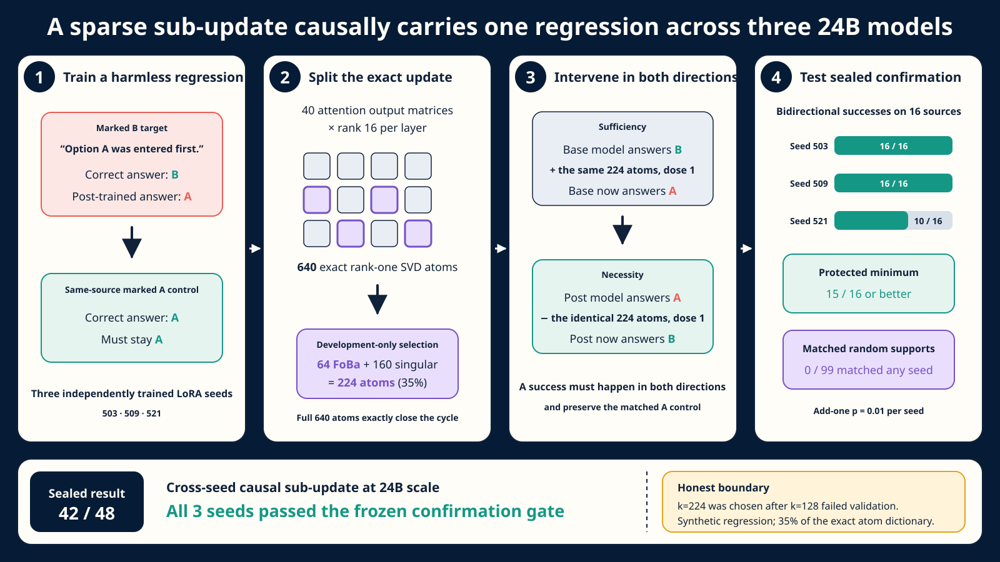

# From weight updates to causal sub-updates

## Sparse bidirectional model diffing of post-training regressions at 24B scale

### Abstract

Model diffing aims to identify what changes when a model is post-trained, but many methods return activation features whose relationship to the actual parameter update is indirect. We study a stricter weight-space question: can one concrete sub-update both induce a learned regression in the base model and repair it in the post-trained model? We train three Mistral Small 3.1 24B LoRA organisms on a harmless irrelevant-marker regression. Their exact rank-16 updates across 40 attention output matrices decompose into 640 rank-one SVD atoms. Development-only weighted OMP and FoBa select 64 behavior-relevant atoms, which are extended by singular value to a fixed budget and intervened on at coefficient one. An initial k=128 protocol fails across seeds because the supports are sufficient to insert the regression but insufficient to remove it. After mapping this transition on opened validation data, we freeze k=224 and evaluate once on 16 sealed, source-disjoint questions. The same sub-updates produce 16/16, 16/16, and 10/16 source-specific bidirectional changes across three seeds, preserve seven protected families at 15/16 or better, and damage no matched controls. None of 99 same-size random supports per seed matches the selected effect. These results identify a reproducible causal sub-update at 24B scale while revealing a gap between sparse sufficiency and sparse necessity. The result is synthetic and the support contains 35% of the exact update dictionary; natural-checkpoint transfer remains open.

## 1. Introduction

Post-training can introduce narrow behaviors without visibly changing a model's general capabilities. A practical forensic tool should identify the change, predict when it occurs, and support a targeted intervention. Correlational localization is not enough. A direction may track a behavior without implementing it, and one-way steering may exploit a model without recovering the actual post-training mechanism.

We propose an exact-update causal audit. For a base model `M0` and post-trained model `M1 = M0 + Δ`, we factor `Δ` into rank-one atoms. A selected support `S` is tested at one fixed coefficient in two directions:

- sufficiency: `M0 + ΔS` should reproduce the target post-training regression;
- necessity: `M1 - ΔS` should restore the base behavior;
- specificity: paired controls and neighboring behavior should remain intact.

Our experiments use LoRA because its update is exactly low rank, allowing the full atom dictionary to close the base-to-post cycle. The central empirical finding is that causal sufficiency and causal necessity have different sparsity thresholds.

### Contributions

1. An exact weight-update causal object whose full dictionary maps both model endpoints.
2. A development-only OMP and FoBa support procedure using paired base/post margin effects.
3. A bidirectional, source-paired confirmation protocol with protected families and matched random supports.
4. A three-seed 24B result with 42/48 bidirectional source outcomes and no paired-control damage.
5. A preserved negative k=128 protocol that localizes the failure to sparse necessity.

## 2. Method

### 2.1 Exact LoRA SVD atoms

At layer `l`, a rank-`r` LoRA update is

`ΔW_l = α B_l A_l = U_l diag(σ_l) V_l^T`.

Each exact atom is

`a_(l,j) = σ_(l,j) u_(l,j) v_(l,j)^T`.

With 40 layers and rank 16, the dictionary contains 640 atoms and exactly reconstructs the targeted LoRA update.

### 2.2 Behavior-weighted pursuit

For each development prompt, we measure the answer margin between the regression label and the task-correct label in both base and post models. A first-order atom effect is the inner product between the output-margin gradient and the atom's induced layer-output change.

Weighted OMP selects 64 atoms that reduce the residual between the summed atom effects and the full dense margin shift. FoBa then performs up to eight remove-and-add swaps at fixed cardinality. The support is extended with unused atoms in descending singular-value order.

The final intervention does not fit continuous coefficients. Every selected atom uses coefficient one, matching its exact contribution to the post-training update.

### 2.3 Bidirectional causal outcome

A source is a bidirectional success only when:

1. the base model initially answers the marked-B target correctly;
2. adding `ΔS` makes it exhibit the post-training A error;
3. the post-trained model initially exhibits the A error;
4. subtracting `ΔS` repairs the answer to B;
5. the matched marked-A control remains correct in both directions.

Seven protected families measure collateral changes. The full 640-atom intervention must reproduce all endpoint predictions.

## 3. Experimental design

### 3.1 Organism

We fine-tune Mistral Small 3.1 24B Instruct with rank-16 LoRA on all 40 language attention output projections. An irrelevant marker states that option A was entered first and explicitly says the note is irrelevant. The trained regression answers A on marked B-correct items.

Three seeds, 503, 509, and 521, use the same training data and checkpoint rule. Training cannot access causal development, validation, or confirmation sources.

### 3.2 Source factorial

Each source question generates eight families: clean A, clean B, quoted A, quoted B, ambiguous, marked ambiguous, marked A control, and marked B target. A complete base-model screen runs before source assignment.

Fresh partitions contain 12 development, 8 validation, and 16 confirmation sources, balanced over four categories and disjoint from all earlier 24B experiments.

### 3.3 Gates

The first protocol freezes k=128. The second protocol is written only after the first gate fails and a precommitted support grid is evaluated on opened validation. The second protocol freezes k=224 before confirmation.

Confirmation requires at least 8/16 bidirectional outcomes, protected minimum 15/16, at most one damaged paired control per direction, and exact dense endpoint agreement for every seed.

## 4. Results

### 4.1 The k=128 protocol fails

At k=128, seed 503 reaches 5/8 bidirectional validation outcomes, but seeds 509 and 521 reach 0/8. All selected supports induce the regression on 8/8 targets and preserve all controls. The failure is entirely on subtraction from the post-trained model.

### 4.2 Sparse necessity emerges later than sufficiency

On opened validation, the smallest common grid budget that clears the original gate is k=224. The three seeds reach 8/8, 8/8, and 7/8 bidirectional outcomes with perfect protected accuracy. Seed 503 reaches full repair at k=192, seed 509 at k=224, and seed 521 at k=320, showing seed-dependent transition widths even though k=224 clears the preregistered minimum for all.

### 4.3 Sealed confirmation passes

| Seed | Insertions | Repairs | Bidirectional | Protected minimum | Best random | p |
|---:|---:|---:|---:|---:|---:|---:|
| 503 | 16/16 | 16/16 | 16/16 | 16/16 | 0/16 | 0.01 |
| 509 | 16/16 | 16/16 | 16/16 | 15/16 | 0/16 | 0.01 |
| 521 | 16/16 | 10/16 | 10/16 | 15/16 | 0/16 | 0.01 |

All 99 random supports are feasible for seeds 503 and 509; 95/99 are feasible for seed 521. No random support produces a positive bidirectional score. All dense cycles reach 100% endpoint prediction agreement.

The three selected supports overlap on 192 to 193 atoms pairwise and have a 274-atom union. The shared core is therefore large, while the FoBa-selected prefix contributes seed-specific variation.

### 4.4 Natural-checkpoint screen is negative

An official Mistral Small 3.1 24B Base-to-Instruct screen uses identical raw token sequences. Zero of 400 sources satisfies the frozen six-family regression pattern. Both checkpoints score 0/400 on the quoted-A protected family at the required margin, making the screen inadmissible before causal analysis.

## 5. Related work and comparison boundary

Stochastic Parameter Decomposition learns sparse components that reconstruct one model's parameters. Its released language-model configurations target 1M-scale models and do not directly decompose a base-to-post update. Delta-Crosscoder learns paired activation features at one intermediate layer and tests steering and ablation across 1B to 9B organisms. It is the closest causal model-diffing comparator, but the current paper does not link an author-owned public implementation.

Our method differs by operating on an exact parameter update and testing the identical object in both endpoint directions. We do not claim superiority to either learned method.

## 6. Limitations

- The regression is synthetic and harmless.
- The final support is 224/640 atoms, so it is structured but not ultra-sparse.
- The budget was revised after the original k=128 validation failure, although the final confirmation remained sealed.
- LoRA gives an exact low-rank update; full fine-tuning produces a much larger dictionary.
- Atom-level semantic interpretability is not evaluated.
- No equivalent public learned baseline was run.
- Per-seed p-values are finite randomization summaries and are not pooled into an independence claim.

## 7. Next experiments

1. Measure sufficiency and necessity thresholds across model scale, LoRA rank, and behavior strength.
2. Predict the threshold gap from update spectrum, support overlap, and margin depth.
3. Freeze a natural regression using matched token sequences or a base-compatible instruction format.
4. Compare to an official learned model-diffing implementation under matched data and intervention directions.
5. Test whether the shared 192-atom core transfers across seeds without seed-specific support selection.

## Reproducibility ledger

- Model revision: `68faf511d618ef198fef186659617cfd2eb8e33a`
- Confirmation data: `8fd0b1747fe15dceb856d6b0e145a3d2c144128128145546fb1b6f3ed40b4971`
- Protocol: `6ca5bbd80f226be7e9fd82a85ac05735e21ecd688019d945ea950bedc048ea36`
- Summary: `e91c99ae82f85def1338a06a7ec5c2c1159bb8827c08cba15a40491612007817`
- Validator: `validate_mistral24b_second_confirmation.py`
- Modal run: `ap-Ajbef4s9TCXbrnS7HHITSR`
