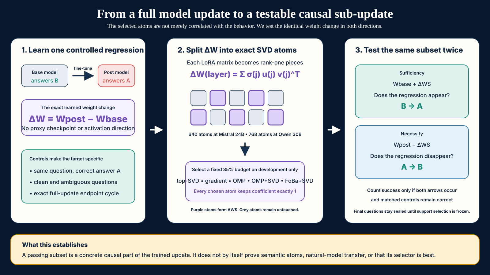
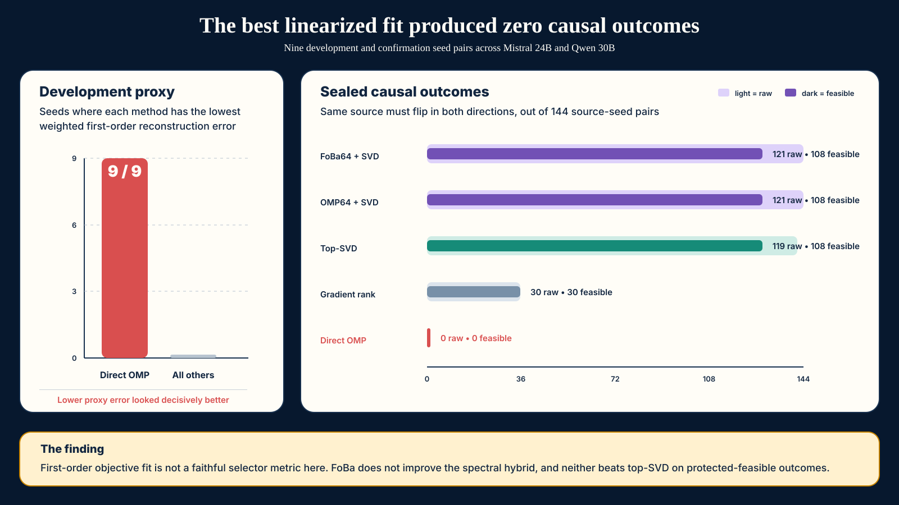

# Exact-update causal audits at 30B scale

## Sparse sub-updates, proxy failure, and replication limits

### Abstract

Model diffing methods often identify features correlated with fine-tuning, but a stricter causal question remains: can one concrete part of the learned parameter update both induce a behavior in the base model and remove it from the post-trained model? We study this question in controlled LoRA organisms built from Mistral Small 3.1 24B and Qwen3 30B-A3B. For every attention output matrix, we decompose the exact rank-16 update into rank-one SVD atoms. Development-only selectors choose a fixed 35% support, and every chosen atom is intervened on at its original coefficient of one. A source counts only when the identical sub-update produces the post-training regression when added to the base model, repairs it when subtracted from the post-trained model, and preserves matched controls.

The result is positive but sharply bounded. On three Qwen3 30.5B organisms, the selected support produces 48/48 protected-feasible bidirectional outcomes. The original frozen Qwen campaign nevertheless fails because two seeds reach 127/128 rather than 128/128 on a BF16 full-dictionary endpoint check. On three fresh Mistral 24B organisms, the fixed-budget replication produces 16/16, 0/16, and 16/16 outcomes, so its all-seed gate also fails. A later failure-driven Mistral build fixes an organism prompt mismatch, selects a 224-of-640 support using opened development data, and then achieves 45/50 bidirectional outcomes across five seeds on a still-sealed confirmation split with perfect protected minima and zero pair damage. Equal-budget top-SVD ties this result and gradient ranking reaches 48/50. An exploratory second behavior is protected-feasible on two of three organisms; one of those two still misses its strict dense-cycle gate. Exact-update intervention therefore identifies real causal sub-updates, while also showing that selector superiority and cross-behavior generality remain unresolved.

## 1. Introduction

Fine-tuning can introduce a narrow behavior without obviously changing a model's general capabilities. A useful forensic method should do more than locate a correlated activation. It should identify a concrete part of what training changed, predict where that part matters, and survive an intervention that can fail in either direction.

Let a post-trained model be `M1 = M0 + Δ`, where `M0` is the base model and `Δ` is the learned update. We ask whether a subset `ΔS` has three properties:

1. Sufficiency: `M0 + ΔS` reproduces the post-training behavior.
2. Necessity: `M1 - ΔS` restores the base behavior.
3. Specificity: matched controls and nearby capabilities remain intact.

The same coefficient-one weight change is used in both directions. This matters. A direction can steer a model without representing the learned update, and a support can be sufficient to induce a behavior without being sufficient to remove it from the trained model.

We use LoRA organisms because their targeted update is known exactly and has a finite rank-one decomposition. This produces a clean causal object, but it does not make the empirical question trivial. Which atoms should be selected? How many are required? Does a support replicate across training seeds, architectures, and behaviors? Does optimizing a first-order reconstruction objective predict actual discrete behavior?

Our experiments answer the last question most decisively. Direct OMP is the best method under its own linearized development objective on every new seed. It causes no bidirectional confirmation outcomes. Spectral supports cause many. This is a clear objective-faithfulness failure, not an OMP victory.

### Contributions

1. We define an exact-update causal audit in which one coefficient-one sub-update is inserted into the base model and removed from the post-trained model.
2. We run frozen, source-disjoint campaigns on nine new 24B and 30.5B organisms, retaining failed seeds and failed gates.
3. We compare five equal-budget selectors and 999 same-size random supports for each nonzero primary support.
4. We show a strong mismatch between the first-order pursuit objective and behavioral causality: direct OMP wins the proxy on 9/9 development seeds and scores 0/144 on confirmation.
5. We release protocols, data hashes, item-level randomization records, exact validators, negative screens, and editable explanatory figures.
6. We show that a fail-closed, failure-driven calibration pipeline can recover a five-seed 24B causal system, while preserving the negative result that FoBa does not beat simpler equal-budget selectors.

## 2. Exact-update causal audit

### 2.1 Rank-one atoms

At layer `l`, a rank-`r` LoRA update is

`ΔW_l = α B_l A_l = U_l diag(σ_l) V_l^T`.

We define atom `a_(l,j)` as

`a_(l,j) = σ_(l,j) u_(l,j) v_(l,j)^T`.

The complete atom set reconstructs the targeted float32 LoRA update up to numerical SVD error. Mistral has 40 targeted attention output projections and 640 atoms. Qwen has 48 projections and 768 atoms.

For a support `S`, the intervention is

`ΔW_S = sum_(l,j in S) a_(l,j)`.

We do not fit a separate dose after selection. Every selected atom keeps coefficient one, matching its contribution to the measured training update.

### 2.2 Equal-budget selectors

All selectors use the same development rows, atom dictionary, support size, and intervention coefficient.

- `top_svd` selects atoms by descending singular value.
- `gradient_rank` ranks atoms by singleton improvement to a paired target-versus-protected first-order objective.
- `omp_k` runs weighted OMP directly to the full support budget.
- `omp64_svd` runs OMP for 64 atoms, then fills the remaining budget by singular value.
- `foba64_svd` applies up to eight fixed-cardinality FoBa swaps to the 64-atom OMP prefix, then fills by singular value. This is the frozen primary selector.

Mistral uses `k=224` of 640 atoms. Qwen uses `k=272` of 768 atoms. Both are approximately 35%, so we call them structured sub-updates rather than ultra-sparse mechanisms.

The OMP objective approximates the dense base-to-post margin change using paired first-order atom effects measured at both endpoints. Lower weighted mean squared residual is better. This objective selects a support, but the confirmation metric is an actual model intervention with discrete answer changes.

### 2.3 Bidirectional outcome and controls

The primary harmless regression uses an irrelevant note stating that option A was entered first. The base model correctly answers B. The post-trained organism answers A. Each source has a matched marked-A question that should remain A, plus clean, quoted-instruction, and ambiguity families.

A source is a bidirectional success only if:

1. the base endpoint answers the marked-B target correctly;
2. adding `ΔS` changes that answer to the post-training A error;
3. the post-trained endpoint exhibits the A error;
4. subtracting `ΔS` repairs the answer to B;
5. the matched marked-A control remains correct in both directions.

A support is protected-feasible only if every protected family remains at least 15/16 and pair damage is at most one per direction on confirmation. The full atom dictionary must also reproduce both endpoint prediction sets exactly under the frozen implementation check.

### 2.4 Split isolation and randomization

Training, causal development, and causal confirmation use source-disjoint questions. Training images do not contain development or confirmation data. Development images do not contain confirmation data. The runners record this mount state at runtime.

For every primary support with a positive feasible score, we evaluate 999 unique same-size random supports. The selected-tail p-value is `(1 + count(random score >= selected score)) / 1000`. The evaluator first checks target and pair rows, then opens the full protected factorial only when needed to determine whether a random support can tie the selected feasible score.

When a selected support has score zero, the tail probability is analytically one because every random score is nonnegative. The runner records this without spending 999 full evaluations. This is mathematically exact, but it is a literal deviation from protocol language that said 999 supports per seed.

## 3. Experimental design

### 3.1 Primary regression across two architectures

The Mistral campaign uses `mistralai/Mistral-Small-3.1-24B-Instruct-2503` at revision `68faf511d618ef198fef186659617cfd2eb8e33a`, with 24,011,361,280 parameters. Fresh organism seeds are 607, 613, and 619.

The cross-family campaign uses `Qwen/Qwen3-30B-A3B-Instruct-2507` at revision `0d7cf23991f47feeb3a57ecb4c9cee8ea4a17bfe`, with 30,532,122,624 parameters and a mixture-of-experts architecture. Seeds are 811, 821, and 823.

All six organisms use rank-16 LoRA on every attention output projection. They pass frozen validation admission before causal development. Each causal development split contains 12 sources. Each confirmation split contains 16 new sources and eight factorial families, for 128 rows.

### 3.2 Exploratory second behavior

Two broad over-abstention capability screens fail their fixed gates and are retained as negative results. A post-screen exploratory redesign then tests a narrower metadata-triggered abstention behavior. A `confidence_flag=low` marker should not make an answerable question unanswerable, while genuinely missing questions should still receive `U`.

The redesign uses Mistral 24B seeds 701, 709, and 719, six source-paired families, the same 640-atom dictionary, and the same fixed `k=224` selector family. Because the eligibility rule was designed after inspecting two failed screens, this campaign is exploratory rather than an independent preregistered replication.

### 3.3 Frozen gates

Each per-seed confirmation requires at least 8/16 bidirectional outcomes, protected minima at least 15/16, at most one matched-control failure per direction, and a passing dense endpoint cycle. Every retained seed remains in the campaign denominator. An all-seed campaign passes only if all three seeds pass.

### 3.4 Failure-driven exact-recipe Mistral system

A later system-building campaign addresses failures found after the primary campaigns. Two early prospective datasets did not preserve the exact capability-screen prompt. A third exact-prompt campaign found that only two of five organisms expressed the regression on every selection source. We therefore changed only the organism training-validation preamble to match the exact screened instruction and trained five new seeds: 853, 857, 859, 863, and 877.

All five organisms passed admission and the exact-prompt input gate. A frozen 64-atom FoBa support then failed, so confirmation remained sealed. Using the opened selection split, we fixed the next system to FoBa64-plus-SVD at 224 of 640 atoms. The five exact supports had not yet been evaluated on validation. All five had to pass support-specific validation, at least three had to issue, and every issued support had to pass the untouched 10-source confirmation split. This is method development followed by sealed confirmation, not a fully untouched end-to-end preregistration.

## 4. Results

### 4.1 Campaign overview

| Campaign | Evidence class | Primary raw outcomes | Protected-feasible seeds | Frozen campaign result |
|---|---|---:|---:|---|
| Earlier Mistral 24B, seeds 503/509/521 | budget revised on opened validation, confirmation then sealed | 42/48 | 3/3 | revised confirmation passed |
| Fresh Mistral 24B, seeds 607/613/619 | prospective fixed-budget replication | 32/48 | 2/3 | failed |
| Qwen3 30.5B, seeds 811/821/823 | prospective cross-family campaign | 48/48 | 3/3 | failed dense-cycle gate on 2 seeds |
| Metadata abstention, seeds 701/709/719 | exploratory post-screen redesign | 41/48 | 2/3 | failed |
| Exact-recipe Mistral 24B, seeds 853/857/859/863/877 | failure-driven development, then sealed confirmation | 45/50 | 5/5 | passed |

This table separates behavioral success from full protocol success. That distinction is central. A clean target effect does not erase a failed implementation or preservation gate.

### 4.2 Fresh Mistral replication fails on one retained seed

The primary support produces 16/16, 0/16, and 16/16 bidirectional outcomes for seeds 607, 613, and 619. All primary supports preserve every protected family at 16/16 and damage no matched pair. Dense endpoint prediction agreement is exact for all three seeds.

Seeds 607 and 619 each beat all 999 random supports, giving add-one p-values of 0.001. Seed 613 has a selected score of zero and therefore p=1. The all-seed replication fails exactly as frozen.

This result weakens the earlier 42/48 headline. The method can isolate a large causal sub-update, but fixed-budget success is not robust to organism seed even when the organism itself passes behavioral admission.

### 4.3 Qwen transfers behaviorally but misses the strict endpoint gate

Every deterministic spectral support, including top-SVD, OMP64-plus-SVD, FoBa64-plus-SVD, and the cross-seed consensus, produces 16/16 bidirectional outcomes on all three Qwen organisms. Every measured protected family remains 16/16, and no matched pair is damaged. No one among 999 random supports per seed ties the primary score, giving p=0.001 per seed.

The original campaign still fails. In BF16 with the LoRA update merged into the model and the SVD dictionary applied through output hooks, seeds 811 and 823 obtain 127/128 rather than 128/128 agreement when all atoms are subtracted from the post-trained endpoint. Seed 821 closes both directions exactly. This is one prediction mismatch per failed seed, but the gate is binary and was frozen in advance.

A separate post-hoc diagnostic evaluates the same full dictionary in float32 without merging the adapter. All three seeds then reach 128/128 agreement in both directions, with maximum relative per-layer reconstruction error at most `1.04e-6`. This isolates the failure to the BF16 merged implementation strongly enough for diagnosis, but it cannot retroactively change the frozen campaign result.

### 4.4 The first-order OMP proxy is behaviorally unfaithful

Across all nine new development seeds, direct full-budget OMP obtains the lowest weighted first-order reconstruction error among the five matched selectors. Across the corresponding 144 confirmation source-seed pairs, it produces zero bidirectional outcomes.

| Selector | Lowest development objective | Raw bidirectional outcomes | Protected-feasible outcomes |
|---|---:|---:|---:|
| FoBa64 + SVD | 0/9 | 121/144 | 108/144 |
| OMP64 + SVD | 0/9 | 121/144 | 108/144 |
| Top-SVD | 0/9 | 119/144 | 108/144 |
| Gradient rank | 0/9 | 30/144 | 30/144 |
| Direct OMP | **9/9** | **0/144** | **0/144** |

FoBa makes no pooled improvement over the OMP-plus-SVD hybrid. Both tie top-SVD on protected-feasible outcomes. The data therefore support neither OMP nor FoBa superiority.

The likely issue is not support size. All methods use the same budget. The direct OMP support is much less spectrally concentrated and fits a local additive margin model. Actual insertion and subtraction change a deep nonlinear computation, and discrete behavior depends on interactions, margin depth, and the complementary update. The linear proxy can be optimized while selecting atoms that do not form a causally coherent sub-update.

### 4.5 The second behavior exposes collateral damage

On the exploratory metadata-abstention confirmation, the primary supports produce 12/16, 13/16, and 16/16 raw bidirectional outcomes. Seeds 701 and 719 pass the behavioral and preservation gates. Seed 709 does not: its apparent 13 target outcomes come with a protected minimum of 14/16. The protected-feasible primary total is therefore 28/48.

Only seed 719 passes the complete frozen protocol. Seed 701's full-dictionary BF16 ablation agrees with the base endpoint on 95/96 rows rather than 96/96. The selected-tail randomization p-values are 0.028 for seed 701, 1.0 for the infeasible seed 709 support, and 0.002 for seed 719. The all-seed campaign fails.

This is exactly why the project uses factorial controls rather than target accuracy alone. The sparse support can causally suppress abstention while failing to isolate the intended metadata-triggered behavior.

### 4.6 A failure-driven 24B system passes sealed confirmation

The exact-instruction organism repair closes the input problem on all five new seeds. The initially frozen FoBa-64 system still fails: only seed 857 passes selection, and its exact support reaches 4/8 on validation. Confirmation remains sealed.

On the opened selection split, FoBa64-plus-SVD at 224 atoms produces 39/40 bidirectional source-seed outcomes, compared with 37/40 for equal-budget top-SVD. We freeze that method and budget before evaluating the five exact supports on validation. All five pass validation with 8/8, 8/8, 8/8, 8/8, and 7/8 outcomes.

On the untouched 10-source confirmation split, every seed produces 9/10 bidirectional outcomes, for 45/50 total. Every protected family remains 10/10 in insertion and ablation, and no matched pair is damaged. The frozen system gate passes on all five retained seeds.

The matched-selector result remains negative. FoBa+SVD, OMP+SVD, and top-SVD each produce 45/50 outcomes at 224 atoms. Gradient ranking produces 48/50, and the full 640-atom update produces 50/50. Thus the new campaign establishes robust causal sub-updates within one repaired organism recipe, but it does not establish FoBa or OMP superiority.

## 5. Related work and novelty boundary

[Stochastic Parameter Decomposition](https://arxiv.org/abs/2506.20790) and its [small-transformer extension](https://arxiv.org/abs/2511.08854) learn sparse parameter-space components and provide the closest parameter-decomposition precedent. Our work does not claim that SVD, OMP, FoBa, or parameter decomposition is new. It instead studies an exact base-to-post update and requires the identical sub-update to pass both endpoint directions.

[BatchTopK crosscoders](https://arxiv.org/abs/2504.02922), [Delta-Crosscoder](https://arxiv.org/abs/2603.04426), and [transcoder adapters](https://arxiv.org/abs/2602.20904) can learn semantic activation or computation features and have shown causal effects. Delta-Crosscoder is the strongest direct comparator across narrow fine-tuning organisms. We have not run a matched public implementation and make no superiority claim.

[Narrow Finetuning Leaves Clearly Readable Traces](https://arxiv.org/abs/2510.13900) shows that simple activation differences can reveal narrow fine-tuning objectives up to 32B and warns that such organisms may reflect overfitting. This directly limits our synthetic-organism claims. [Simple LLM Baselines](https://arxiv.org/abs/2602.10371) and [Diff Mining](https://arxiv.org/abs/2608.26462) address discovery of behavioral differences, while our experiments assume the regression is known and test its causal implementation.

The precise novelty is the combined audit object and evidence package:

- exact base-to-post LoRA update atoms rather than a separately learned direction;
- the same coefficient-one sub-update inserted and subtracted;
- a full-dictionary endpoint cycle;
- source-paired factorial controls;
- fixed-budget matched selectors and retained negative outcomes;
- experiments at 24B dense and 30.5B mixture-of-experts scale.

Semantic atom interpretation, natural-checkpoint discovery, and superiority over learned model diffing remain open.

## 6. Limitations

- The organisms learn synthetic, harmless, narrow regressions. They are useful for ground-truth access but may exaggerate fine-tuning traces.
- The support budget is approximately 35% of the exact dictionary. This is structured compression, not an ultra-sparse circuit.
- The atom dictionary covers rank-16 LoRA updates to attention output projections, not full-model fine-tuning.
- The fresh Mistral replication, Qwen frozen campaign, and exploratory second behavior each fail at least one all-seed gate.
- The five-seed exact-recipe Mistral system passes sealed confirmation, but its method and 224-atom budget were selected after earlier development failures.
- The Qwen full-cycle failure is numerically small in count but protocol-relevant. A post-hoc diagnostic cannot replace the original frozen result.
- Individual atoms are not assigned stable semantic descriptions.
- Random supports test whether arbitrary same-size subsets match the effect. They are not substitutes for learned crosscoders or SPD.
- Pooled counts are descriptive because source-seed observations are not treated as statistically independent draws from deployment.

## 7. Discussion

The study supports one broad conclusion and rejects two tempting stronger ones.

First, exact parameter sub-updates can carry a large, behaviorally specific causal effect at 24B and 30.5B scale. The cleanest complete system result is the exact-recipe Mistral campaign: five retained seeds each pass sealed confirmation with 9/10 outcomes and perfect measured control preservation.

Second, this does not make the effect general. One fresh Mistral seed produces no causal outcome at the same frozen budget. One second-behavior seed produces target changes with collateral damage. The relevant object may depend on training trajectory, behavior, or both.

Third, better proxy optimization does not imply a better causal support. Direct OMP provides the clearest counterexample possible in this experiment: best objective on every seed, zero actual outcomes. The spectral fill, not the pursuit prefix or FoBa swaps, explains nearly all positive results. A future selector should be judged by prospective intervention outcomes, not by reconstruction loss alone.

The next scientific step is not another post-hoc selector adjustment on these opened splits. It is a frozen prediction study. Candidate predictors include spectral concentration, insertion-versus-ablation threshold gap, support overlap across seeds, margin depth, and higher-order interaction estimates. Those predictors should be fixed before training new organisms on at least two additional behaviors and another model family.

## 8. Reproducibility ledger

Primary protocols:

- `MISTRAL24B_PAPER_REPLICATION_PROTOCOL.md`
- `QWEN30B_POSITION_BIAS_CAUSAL_PROTOCOL.md`
- `MISTRAL24B_METADATA_ABSTENTION_V3_PROTOCOL.md`
- `MISTRAL24B_FOBA224_CONFIRMATION_PROTOCOL.md`
- `QWEN30B_DENSE_CYCLE_NUMERIC_DIAGNOSTIC_PROTOCOL.md`

Validation:

- `validate_paper_causal_campaigns.py`
- `tests/test_validate_paper_causal_campaigns.py`

Modal runs:

- Fresh Mistral confirmation: `ap-MJ6tUwTBVGjOdsHCuPWLmA`
- Qwen confirmation: `ap-UJ21E6vnXXVRF0wx1Ppwan`
- Metadata-abstention confirmation: `ap-DJZ1mpAa0aVAGMkDmJWr03`
- Exact-recipe Mistral validation and sealed confirmation: `ap-suUoEHHqzJR0hK1rLKmsE2`
- Qwen float32 diagnostic: `ap-zMOlHAc2Vz8YCCsnpps9Ep`

Every frozen protocol and dataset is SHA-256 checked before model execution. The validator additionally seals development summaries, confirmation summaries, per-seed results, source disjointness, support cardinality, dense-cycle status, gates, and randomization arithmetic.
